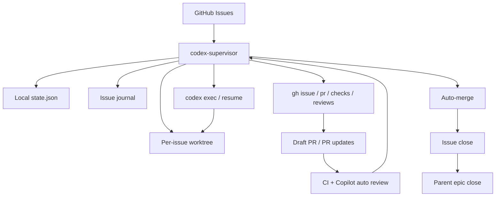

# codex-supervisor

Minimal GitHub issue/PR/CI supervisor for `codex exec` and `gh`.

The design goal is small, durable orchestration:

- GitHub is the source of truth
- the supervisor keeps local persistent state
- each Codex turn is a fresh `codex exec` or `codex exec resume`
- after every turn, the supervisor re-reads issue, PR, checks, reviews, and mergeability from GitHub

This keeps loop continuity outside the chat thread.

## Architecture



The supervisor itself is intentionally small. It decides the next action from GitHub facts plus local state, not from long-lived chat memory.

## Current scope

- one managed repository per config
- one active issue at a time
- per-issue worktree
- JSON state store
- GitHub operations via `gh`
- Codex execution via `codex exec`

## Run states

- `queued`
- `planning`
- `reproducing`
- `implementing`
- `stabilizing`
- `draft_pr`
- `pr_open`
- `repairing_ci`
- `resolving_conflict`
- `waiting_ci`
- `addressing_review`
- `ready_to_merge`
- `merging`
- `done`
- `blocked`
- `failed`

`blocked` also records `blocked_reason`, currently one of:

- `requirements`
- `permissions`
- `secrets`
- `verification`
- `manual_pr_closed`
- `handoff_missing`
- `unknown`

## Requirements

- `gh auth status` succeeds
- `codex` CLI is installed
- the managed repository already has branch protection / merge policy configured
- the managed repository is cloned locally

## Configuration

Create `supervisor.config.json` from [supervisor.config.example.json](./supervisor.config.example.json).

Important fields:

- `repoPath`: absolute path to the managed repository
- `repoSlug`: `OWNER/REPO`
- `workspaceRoot`: directory used for per-issue worktrees
- `stateFile`: local JSON state file
- `codexBinary`: path to the Codex CLI
- `sharedMemoryFiles`: durable repo-memory files to reference every turn
- `issueJournalRelativePath`: per-issue handoff journal inside each worktree
- `issueLabel`: optional issue label filter
- `issueSearch`: optional GitHub issue search query
- `skipTitlePrefixes`: optional title prefixes to exclude, for example `["Epic:"]`
- `branchPrefix`: branch prefix, usually `codex/issue-`
- `copilotReviewWaitMinutes`: grace period after a PR becomes ready or gets a new head SHA
- `codexExecTimeoutMinutes`: per-turn timeout
- `maxCodexAttemptsPerIssue`: total Codex-turn budget per issue
- `timeoutRetryLimit`: timeout-only retry budget
- `blockedVerificationRetryLimit`: retry budget for verification blockers
- `sameBlockerRepeatLimit`: repeated-blocker stop limit
- `sameFailureSignatureRepeatLimit`: repeated failure-signature stop limit
- `cleanupDoneWorkspacesAfterHours`: cleanup delay for done worktrees
- `mergeMethod`: `merge`, `squash`, or `rebase`
- `draftPrAfterAttempt`: attempt number after which a clean checkpoint may become a draft PR

## Durable memory

Codex threads do not automatically share conversation history. This supervisor treats repo files as the durable shared memory.

Typical files:

- `README.md`
- `docs/architecture.md`
- `docs/constitution.md`
- `docs/workflow.md`
- `docs/decisions.md`

The supervisor also keeps a per-issue journal in each worktree. Codex is required to update that journal before ending a turn.

Template shared-memory files are included here:

- [docs/shared-memory/constitution.example.md](./docs/shared-memory/constitution.example.md)
- [docs/shared-memory/workflow.example.md](./docs/shared-memory/workflow.example.md)
- [docs/shared-memory/decisions.example.md](./docs/shared-memory/decisions.example.md)

## Issue metadata

For safe sequencing, put explicit metadata in issue bodies. Supported fields are documented in [docs/issue-metadata.md](./docs/issue-metadata.md).

Currently enforced:

- `Depends on: #123, #124`
- `Part of #...`
- `## Execution order`

## Commands

```bash
npm install
npm run build
node dist/index.js status
node dist/index.js run-once
node dist/index.js loop
```

## Runtime

### macOS

Install as a user LaunchAgent:

```bash
./scripts/install-launchd.sh
launchctl print gui/$(id -u)/io.codex.supervisor
```

### Linux

Install as a user systemd service:

```bash
./scripts/install-systemd.sh
systemctl --user status codex-supervisor.service
```

Both installers render a local service file from templates and inject the current repo root, `node`, `npm`, and `PATH`.

## Safety model

- never pushes directly to the default branch
- uses issue-specific branches only
- relies on branch protection for merge safety
- uses issue locks and session locks to avoid duplicate turns
- requires issue-journal handoff before accepting a Codex turn
- waits for Copilot auto review before merge
- handles CI repair, review response, and merge-conflict resolution as separate phases
- closes merged issues automatically
- closes parent epic issues automatically when every child issue is closed

## Current limitations

- JSON state store, not SQLite
- single active issue only
- GitHub-specific workflow assumptions
- no built-in multi-repo scheduler yet

## Validation

The validation checklist used for the original end-to-end proving loop is in [docs/validation-checklist.md](./docs/validation-checklist.md).

Example material:

- managed-repo walkthrough: [docs/examples/atlaspm.md](./docs/examples/atlaspm.md)
- concrete config file: [docs/examples/atlaspm.supervisor.config.example.json](./docs/examples/atlaspm.supervisor.config.example.json)
- architecture notes: [docs/architecture.md](./docs/architecture.md)
