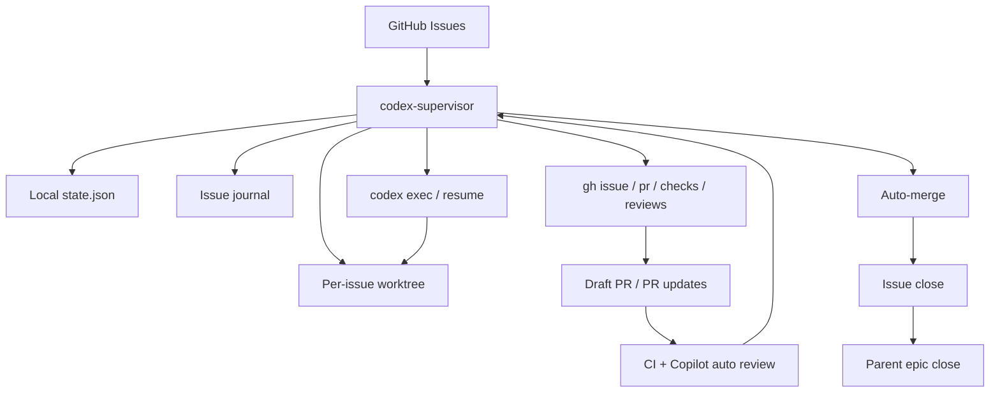

# codex-supervisor

Deterministic, durable GitHub issue/PR/CI supervisor for `codex exec` and `gh`.

The design goal is explicit, durable orchestration:

- GitHub is the source of truth
- the supervisor keeps local persistent state
- each Codex turn is a fresh `codex exec` or `codex exec resume`
- after every turn, the supervisor re-reads issue, PR, checks, reviews, and mergeability from GitHub

This keeps loop continuity outside the chat thread.

Japanese overview: [docs/README.ja.md](./docs/README.ja.md)

## Architecture



The supervisor itself is intentionally explicit and GitHub-driven. It decides the next action from GitHub facts plus local state, not from long-lived chat memory.

## Current scope

- one managed repository per config
- one active issue at a time
- per-issue worktree
- JSON state store
- GitHub operations via `gh`
- Codex execution via `codex exec`

## Best fit

- solo development, or a single clearly-owned automation lane inside a small team
- repositories where issue order and dependencies are explicitly written down
- repos with branch protection, required checks, and a stable PR workflow
- work that can be decomposed into implementation-sized GitHub issues
- teams that want GitHub to remain the source of truth instead of chat history

## Not a fit

- fast-moving multi-author repos where multiple people frequently touch the same area at once
- backlogs where issue priority and dependency order are mostly implicit
- projects that rely on long design discussions inside PRs before code can proceed
- repos where issues are vague prompts rather than execution-ready work items
- workflows that expect the supervisor to invent prioritization, architecture, or team coordination policy on its own

## Readiness-first polling

`codex-supervisor` is designed around readiness polling, not "issue created" events.

- the main question is not "did a new issue appear?"
- the main question is "which open issue is runnable right now?"

This matters when a repo opens an epic and many child issues at once. In that model:

- several issues may become `OPEN` together
- only a subset is actually runnable because of `Depends on` and `Execution order`
- the next useful transition is often "a dependency was merged/closed" rather than "a new issue was created"

For that reason, the intended operating model is:

- keep the supervisor in `loop`
- poll GitHub at a short, regular interval
- re-evaluate issue readiness each cycle against dependency metadata and current PR state

If you need near-immediate reaction, lower `pollIntervalSeconds`. Do not treat issue-creation monitoring as the primary workflow model for ordered epic/child-issue backlogs.

## Run states

- `queued`
- `planning`
- `reproducing`
- `implementing`
- `local_review_fix`
- `stabilizing`
- `draft_pr`
- `pr_open`
- `repairing_ci`
- `resolving_conflict`
- `waiting_ci`
- `addressing_review`
- `ready_to_merge`
- `merging`
- `done`
- `blocked`
- `failed`

`blocked` also records `blocked_reason`, currently one of:

- `requirements`
- `permissions`
- `secrets`
- `verification`
- `manual_review`
- `manual_pr_closed`
- `handoff_missing`
- `unknown`

## Requirements

- `gh auth status` succeeds
- `codex` CLI is installed
- the managed repository already has branch protection / merge policy configured
- the managed repository is cloned locally

## Configuration

Create `supervisor.config.json` from [supervisor.config.example.json](./supervisor.config.example.json).

Provider-specific starting points are also shipped:

- [supervisor.config.copilot.json](./supervisor.config.copilot.json)
- [supervisor.config.codex.json](./supervisor.config.codex.json)
- [supervisor.config.coderabbit.json](./supervisor.config.coderabbit.json)

`supervisor.config.json` remains the active file that the supervisor loads. The provider-specific files are explicit templates: copy the one you want into `supervisor.config.json` or diff against it when switching review bots. The base example and Copilot profile preserve the existing safe Copilot-oriented defaults. The CodeRabbit profile includes both the app slug and bot login so request lifecycle events and review comments match the same configured provider.

### Provider profile setup

Each shipped profile only covers the supervisor-side configuration. You still need the matching provider-side setup in GitHub or in the managed repository before the supervisor can observe usable review signals.

- Copilot profile
  - Supervisor-side: use `supervisor.config.copilot.json` or copy its `reviewBotLogins` entry into `supervisor.config.json`.
  - Provider-side: install and enable GitHub Copilot code review for the repository or organization, and make sure the PR flow you use actually requests or auto-triggers Copilot review after the PR is ready.
  - Verify: open a small test PR, mark it ready, then confirm GitHub shows a Copilot review or review-thread comment from `copilot-pull-request-reviewer`. If the supervisor stays in a Copilot wait state but no Copilot review ever appears, fix the GitHub-side Copilot setup first.
- Codex Connector profile
  - Supervisor-side: use `supervisor.config.codex.json`, which tells the supervisor to watch for `chatgpt-codex-connector`.
  - Provider-side: connect the repository to Codex in ChatGPT/OpenAI and enable whatever repo-level review flow your Codex Connector setup requires. `supervisor.config.json` does not create or authorize that connector for you.
  - Verify: trigger a PR that should receive Codex review and confirm the review arrives in a usable review signal form on GitHub: a bot review, a review summary, or actionable review-thread comments from `chatgpt-codex-connector` that the supervisor can later address. If Codex only posts outside the PR review surface, treat the connector setup as incomplete for supervisor use.
- CodeRabbit profile
  - Supervisor-side: use `supervisor.config.coderabbit.json`, which tracks both `coderabbitai` and `coderabbitai[bot]`.
  - Provider-side: install CodeRabbit on the repository and commit any required repo-side config such as `.coderabbit.yaml` when your policy or review mode depends on it. `supervisor.config.json` only tells the supervisor which bot identities to trust after CodeRabbit is already configured.
  - Verify: open a PR and confirm CodeRabbit posts a normal PR review or unresolved review-thread comments under one of the configured bot identities. If CodeRabbit is installed but never comments on the PR, fix the repo or GitHub app configuration before relying on the profile.

Short checklist:

1. Copy the chosen profile into `supervisor.config.json` and verify `reviewBotLogins` matches the provider you expect.
2. Confirm the provider is installed or connected on the target repository outside the supervisor.
3. Open a test PR and wait for the provider to post review output on the PR itself.
4. Run `node dist/index.js status --config /path/to/supervisor.config.json` and confirm the provider is no longer invisible to the supervisor.
5. Only treat the profile as working when the provider produces a usable review signal on GitHub that you can see and the supervisor can react to.

Important fields:

- `repoPath`: absolute path to the managed repository
- `repoSlug`: `OWNER/REPO`
- `workspaceRoot`: directory used for per-issue worktrees
- `stateBackend`: `json` or `sqlite`
- `stateFile`: local JSON state file
- `stateBootstrapFile`: optional JSON file to import once when initializing a SQLite state database
- `codexBinary`: path to the Codex CLI
- `codexModelStrategy`: `inherit`, `fixed`, or `alias`
- `codexModel`: explicit model or model alias when strategy is `fixed` or `alias`
- `codexReasoningEffortByState`: per-state reasoning policy from `none` to `xhigh`
- `codexReasoningEscalateOnRepeatedFailure`: bump reasoning by one level after repeated failures or verification retries
- `sharedMemoryFiles`: durable repo-memory files to reference every turn
- `gsdEnabled`: enable optional `get-shit-done` collaboration
- `gsdAutoInstall`: install GSD Codex skills automatically on startup if missing
- `gsdInstallScope`: `global` or `local`
- `gsdCodexConfigDir`: optional Codex config directory for GSD installation
- `gsdPlanningFiles`: GSD planning docs to treat as upstream durable memory
- `localReviewEnabled`: run a local review swarm before draft PRs are marked ready, and also on ready PR head updates when `localReviewPolicy` is `block_merge`
- `localReviewAutoDetect`: if `true`, infer a specialist review swarm from the managed repo shape when `localReviewRoles` is empty
- `localReviewRoles`: explicit role labels for the local review swarm; leave empty to rely on auto-detect
- `localReviewArtifactDir`: directory for generated local review artifacts
- `localReviewConfidenceThreshold`: default confidence threshold used for reviewer-type gating when `localReviewReviewerThresholds` is omitted or only partially specified
- `localReviewReviewerThresholds`: deterministic reviewer-type thresholds for `generic` (`reviewer`, `explorer`) and `specialist` roles; each type can set its own `confidenceThreshold` and `minimumSeverity`
- `localReviewPolicy`: `advisory`, `block_ready`, or `block_merge`
- `localReviewHighSeverityAction`: `retry` or `blocked`
- `reviewBotLogins`: bot reviewer logins that the supervisor may auto-address
- `humanReviewBlocksMerge`: if `true`, unresolved human or unconfigured-bot review threads stop auto-merge and require manual intervention
- `issueJournalRelativePath`: per-issue handoff journal inside each worktree
- `issueJournalMaxChars`: compaction budget for the journal handoff section
- `issueLabel`: optional issue label filter
- `issueSearch`: optional GitHub issue search query
- `skipTitlePrefixes`: optional title prefixes to exclude, for example `["Epic:"]`
- `branchPrefix`: branch prefix, usually `codex/issue-`
- `copilotReviewWaitMinutes`: timeout for a requested Copilot review that never arrives on the current PR head
- `copilotReviewTimeoutAction`: fallback after that timeout, either `continue` or `block`
- `codexExecTimeoutMinutes`: per-turn timeout
- `maxImplementationAttemptsPerIssue`: Codex-turn budget before a PR exists
- `maxRepairAttemptsPerIssue`: Codex-turn budget after a PR exists
- `maxCodexAttemptsPerIssue`: legacy fallback used when the split budgets are omitted
- `timeoutRetryLimit`: timeout-only retry budget
- `blockedVerificationRetryLimit`: retry budget for verification blockers
- `sameBlockerRepeatLimit`: repeated-blocker stop limit
- `sameFailureSignatureRepeatLimit`: repeated failure-signature stop limit
- `maxDoneWorkspaces`: maximum number of existing `done` worktrees to retain under `workspaceRoot` (`0` means retain none, negative disables the count cap)
- `cleanupDoneWorkspacesAfterHours`: cleanup delay for done worktrees
- `mergeMethod`: `merge`, `squash`, or `rebase`
- `draftPrAfterAttempt`: attempt number after which a clean checkpoint may become a draft PR

### Model and reasoning policy

`codex-supervisor` can steer model selection and reasoning effort per turn without turning the supervisor into a dynamic model router.

- `codexModelStrategy: "inherit"`: do not pass `--model`; follow the Codex CLI/App default model
- `codexModelStrategy: "fixed"`: pass a specific model every turn
- `codexModelStrategy: "alias"`: pass a moving alias every turn if your Codex environment exposes one

Recommended default:

- set your Codex CLI/App default model to `GPT-5.4`, then use `inherit` so the supervisor follows that default automatically
- use per-state reasoning instead of a single global reasoning level

Practical guidance:

- for most `codex-supervisor` workloads, `GPT-5.4` is a good default
- you do not need to actively rotate through older Codex 5.1 to 5.3 variants unless you have a repo-specific reason
- keep model policy simple; most token and cost tuning should come from reasoning control, not model churn
- do not use `xhigh` in the default per-state policy; reserve it for exceptional escalation paths only

Default reasoning policy:

- `planning`: `low`
- `reproducing`: `medium`
- `implementing`: `high`
- `local_review_fix`: `medium`
- `stabilizing`: `medium`
- `draft_pr`: `low`
- `local_review`: `low`
- `repairing_ci`: `medium`
- `resolving_conflict`: `high`
- `addressing_review`: `medium`

If `codexReasoningEscalateOnRepeatedFailure` is enabled, the supervisor raises reasoning by one level when the current issue is already retrying the same failure path. That escalation path is the main reason to keep `xhigh` available at all. When a fixed or alias model is configured, the supervisor also clamps unsupported reasoning levels to a safe value for known model families.

## Durable memory

Codex threads do not automatically share conversation history. This supervisor treats repo files as the durable shared memory.

Typical files:

- `README.md`
- `docs/architecture.md`
- `docs/constitution.md`
- `docs/workflow.md`
- `docs/decisions.md`

The supervisor also keeps a per-issue journal in each worktree. Codex is required to update that journal before ending a turn.

To keep token usage small and deterministic, the supervisor also generates:

- a compact context index outside the managed repo
- an `AGENTS.generated.md` file outside the managed repo

These generated files tell Codex what to read first and which durable memory files are only on-demand.

### Memory read policy

- always read:
  - `AGENTS.generated.md`
  - the compact context index
  - the current issue journal
- read on demand:
  - `README.md`
  - architecture / workflow / decisions docs
  - any other shared memory files listed in config

The goal is to avoid bulk-reading every durable memory file on every turn while still preserving cross-session memory.

Template shared-memory files are included here:

- [docs/shared-memory/constitution.example.md](./docs/shared-memory/constitution.example.md)
- [docs/shared-memory/workflow.example.md](./docs/shared-memory/workflow.example.md)
- [docs/shared-memory/decisions.example.md](./docs/shared-memory/decisions.example.md)

Committed Local Review Swarm guardrails also live under `docs/shared-memory/`:

- `docs/shared-memory/verifier-guardrails.json`
- `docs/shared-memory/external-review-guardrails.json`

Each committed guardrail document must declare `"version": 1` at the top level. Missing versions, non-integer versions, or unsupported future versions fail validation and loading immediately so schema upgrades remain explicit and deterministic.

Maintain them through the repo-managed workflow:

1. Edit the committed JSON entry in `docs/shared-memory/`.
2. Run `npm run guardrails:fix` to normalize ordering, trimming, and formatting.
3. Run `npm run guardrails:check` to fail on malformed or drifted updates.

The check command rejects duplicate verifier `id` values and duplicate external-review `fingerprint` values so committed guardrails stay deterministic to load and audit.

## State backends

The default state backend is JSON, but SQLite is also supported.

- JSON: simple and easy to inspect, good for local prototypes
- SQLite: better for schema evolution, recovery, and public/general use

To switch to SQLite, set:

```json
{
  "stateBackend": "sqlite",
  "stateFile": "./.local/state.sqlite"
}
```

If you already have JSON state and want a one-time bootstrap into SQLite, also set:

```json
{
  "stateBackend": "sqlite",
  "stateFile": "./.local/state.sqlite",
  "stateBootstrapFile": "./.local/state.json"
}
```

On first load, the supervisor imports the JSON state into SQLite if the SQLite database is empty.

## Issue metadata

For safe sequencing, put explicit metadata in issue bodies. Supported fields are documented in [docs/issue-metadata.md](./docs/issue-metadata.md).

Currently enforced:

- `Depends on: #123, #124`
- `Part of #...`
- `## Execution order`

Example issue body:

```md
## Summary

Persist timeline row layout separately for each swimlane mode so switching views restores the right saved order.

## Scope

- save manual row layout for `section`
- save manual row layout for `assignee`
- save manual row layout for `status`
- keep existing section behavior unchanged

Depends on: #232
Part of #227
Parallelizable: No

## Execution order

7 of 15

## Acceptance criteria

- switching between `section`, `assignee`, and `status` restores each mode's own saved layout
- existing timeline reorder tests still pass
- a focused E2E covers cross-mode persistence

## Verification

- `npm test -- src/timeline-layout.test.ts`
- run the focused swimlane persistence E2E
```

Practical guidance:

- keep one execution-ready change per issue
- use `Summary` to state the intended outcome, not just the area to touch
- use `Scope` to say both what changes and what should stay unchanged
- use `Verification` to name the focused test, command, or manual check that proves the issue is done
- write `Depends on` whenever a later issue would be unsafe without an earlier one
- use `Part of` for epics or parent rollups
- use `Execution order` when a series must be processed in a specific sequence
- if parallel execution is safe, say so explicitly in the issue body instead of expecting the supervisor to infer it

## Commands

```bash
npm install
npm run build
node dist/index.js status
node dist/index.js run-once
node dist/index.js loop
```

`status` is intended to be the first place to look during operations. It reports the active issue, current state, retry counters, failure signature, and live PR/check/review context when a PR exists. If there is no active issue, it reports the latest tracked record instead of only printing an empty state.

## Using Codex as an operator console

Many teams use Codex itself as the human-facing entry point for the supervisor. That is a good fit for this project.

In that operating model:

- `codex-supervisor` is the execution engine
- Codex CLI or Codex App is the operator console

Typical operator requests look like:

- `Build the supervisor and start working atlaspm issues.`
- `Report the current supervisor status.`
- `Requeue issue #123.`
- `Show why the current PR is blocked.`

This is useful because humans can interact in natural language while the supervisor remains a small deterministic state machine over GitHub, local state, worktrees, and `codex exec`.

Recommended boundaries:

- let the supervisor own state, locks, worktrees, and GitHub mutations
- let Codex handle operator requests, inspection, and one-off interventions
- do not treat the chat thread as the source of truth
- prefer `status` plus the state file and GitHub facts when answering operational questions

If you run the supervisor this way, keep the service model simple:

- one long-running `loop` process per config
- optional operator-triggered `run-once` calls only when the global supervisor lock says it is safe
- no assumption that Codex chat history is shared across machines or sessions

## Local review

`codex-supervisor` can optionally run a local review swarm as part of PR gating.

This is designed to reduce dependence on GitHub-hosted auto review. The supervisor:

- waits until the draft PR is green and conflict-free
- runs one separate local review turn per configured role
- supports reviewer roles such as `reviewer`, `explorer`, `docs_researcher`, `prisma_postgres_reviewer`, `migration_invariant_reviewer`, `contract_consistency_reviewer`, `github_actions_semantics_reviewer`, `workflow_test_reviewer`, and `portability_reviewer`
- keeps the same context-budget policy used by implementation turns: read the compact context index and issue journal first, then open durable memory files only on demand
- saves a Markdown summary plus a structured JSON artifact (for example `head-<sha>.json`) under `localReviewArtifactDir`
- keeps older `head-<sha>` artifacts on disk for history; `status` shows both the reviewed artifact SHA and the current PR head SHA so the current-head artifact is obvious
- runs a verifier pass for actionable high-severity findings before stronger high-severity gates react
- deduplicates findings and keeps only findings that meet the configured reviewer-type confidence/severity thresholds
- then continues the normal ready / Copilot wait flow

If `localReviewRoles` is empty and `localReviewAutoDetect` is enabled, the supervisor chooses a baseline swarm from the managed repo shape:

- always starts with `reviewer` and `explorer`
- adds `docs_researcher` when the repo has durable memory or docs
- adds Prisma and migration specialists when it detects Prisma schema and migration-heavy layouts
- adds `ui_regression_reviewer` for Playwright-heavy repos
- adds `github_actions_semantics_reviewer` for repos with GitHub Actions workflows
- adds `workflow_test_reviewer` when workflow-oriented test files are present
- adds `portability_reviewer` for repos where shell/runtime portability is likely to matter

The local review artifacts explain these choices in two forms: the Markdown summary has a concise `Auto-detected roles` section, and the JSON artifact includes machine-readable `autoDetectedRoles` entries with `kind`, `signal`, and `paths`. If you later want deterministic manual control, inspect those reasons, copy the roles you want into `localReviewRoles`, and disable `localReviewAutoDetect`.

By default, `reviewer` and `explorer` are treated as `generic`, and every other role is treated as `specialist`. If you leave `localReviewReviewerThresholds` unset, both reviewer types inherit `localReviewConfidenceThreshold` and keep the current `low` severity floor. When you want specialists to gate more aggressively without making the baseline swarm noisier, raise the `generic` threshold and/or severity floor while leaving `specialist` lower.

Historical local review artifacts are intentionally retained until explicit cleanup. During incident response, use `status` to compare `reviewed_head_sha` with `pr_head_sha`: `head=current` means the artifact applies to the live PR head, while `head=stale` means the artifact is only historical context.

Use explicit `localReviewRoles` when you want full manual control.

This review does not mutate code. The recommended starting policy is `block_merge`, so actionable findings can still block merge on the current ready PR head while the normal draft-to-ready handoff stays intact.

When `localReviewHighSeverityAction` is `retry` and the verifier confirms at least one high-severity finding, the supervisor enters a dedicated `local_review_fix` repair mode. That prompt is narrowed to the compressed root-cause list from the local-review artifact and, when the artifact identifies affected files, it tells Codex to inspect those files first instead of treating the turn as general checkpoint maintenance while the PR or merge is blocked.

During `local_review_fix`, active local-review blockers take priority over stale issue-journal `Next 1-3 actions` handoff text. The supervisor still includes the journal excerpt for context, but it suppresses those stale next-action bullets so old checkpoint guidance does not override the live repair task. If an operator needs to force a temporary repair directive, add a line such as `- Operator override: keep the compatibility shim until the blocker is cleared.` in `### Current Handoff`; that note remains visible during repair turns.

If you want stronger enforcement without giving the review swarm destructive powers, use policy gates instead of auto-closing PRs:

- `block_merge`: recommended default path; allow the PR to become ready, but stop merge while actionable findings remain; the swarm can re-run after ready PR head updates
- `block_ready`: keep draft PRs from becoming ready when actionable findings exist
- `advisory`: save findings only

For high-severity findings, `localReviewHighSeverityAction` can either:

- `blocked`: safer default for solo operators; stop the merge and require explicit human intervention, but only when the verifier confirms at least one high-severity finding
- `retry`: deterministic override for teams that want another repair pass automatically after the verifier confirms at least one high-severity finding

The review artifacts distinguish between raw actionable findings from the review roles and verified findings confirmed by the verifier pass. `block_ready` and `block_merge` still react to raw actionable findings. The stronger high-severity actions above react only to verifier-confirmed high-severity findings, which reduces false positives without hiding the original review signal.

## Runtime

### macOS

Install as a user LaunchAgent:

```bash
./scripts/install-launchd.sh
launchctl print gui/$(id -u)/io.codex.supervisor
```

### Linux

Install as a user systemd service:

```bash
./scripts/install-systemd.sh
systemctl --user status codex-supervisor.service
```

Both installers render a local service file from templates and inject the current repo root, `node`, `npm`, and `PATH`.

### Optional GSD integration

If the host that runs `codex-supervisor` should also have `get-shit-done` available for Codex, install it separately:

Upstream project: [gsd-build/get-shit-done](https://github.com/gsd-build/get-shit-done)

```bash
./scripts/install-gsd.sh global
```

Or enable startup install in `supervisor.config.json`:

```json
{
  "gsdEnabled": true,
  "gsdAutoInstall": true,
  "gsdInstallScope": "global",
  "gsdPlanningFiles": [
    "PROJECT.md",
    "REQUIREMENTS.md",
    "ROADMAP.md",
    "STATE.md"
  ]
}
```

Recommended collaboration boundary:

- GSD owns planning docs and phase definition
- GitHub Issues remain the execution queue
- `codex-supervisor` keeps ownership of worktrees, PRs, CI repair, review handling, and merge
- supervisor turns should read GSD planning docs when needed, but should not run GSD execution workflows inside the automated loop

Operational notes:

- `run-once` and `loop` now trigger GSD auto-install when `gsdAutoInstall` is enabled
- `status` reports whether GSD is both enabled and currently installed
- `./scripts/install-gsd.sh local /path/to/managed-repo` installs GSD into a specific managed repo instead of the supervisor repo

## Safety model

- never pushes directly to the default branch
- acquires a global supervisor lock for every `run-once` / loop cycle before mutating state
- uses issue-specific branches only
- relies on branch protection for merge safety
- uses issue locks and session locks to avoid duplicate turns
- requires issue-journal handoff before accepting a Codex turn
- waits for Copilot auto review before merge
- only auto-addresses review threads from configured bot reviewers
- treats unresolved human or unconfigured-bot review threads as manual blockers when configured
- handles CI repair, review response, and merge-conflict resolution as separate phases
- closes merged issues automatically
- closes parent epic issues automatically when every child issue is closed

If another supervisor process is already active, extra `loop` or `run-once` invocations do not mutate state. They log a skip message and rely on stale-lock cleanup if the previous process died unexpectedly.

## Current limitations

- single state backend per config file
- single active issue only
- GitHub-specific workflow assumptions
- no built-in multi-repo scheduler yet

## Validation

The validation checklist used for the original end-to-end proving loop is in [docs/validation-checklist.md](./docs/validation-checklist.md).

Example material:

- managed-repo walkthrough: [docs/examples/atlaspm.md](./docs/examples/atlaspm.md)
- concrete config file: [docs/examples/atlaspm.supervisor.config.example.json](./docs/examples/atlaspm.supervisor.config.example.json)
- GSD to GitHub issue template: [docs/examples/gsd-to-github-issues.md](./docs/examples/gsd-to-github-issues.md)
- architecture notes: [docs/architecture.md](./docs/architecture.md)
