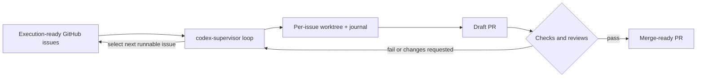
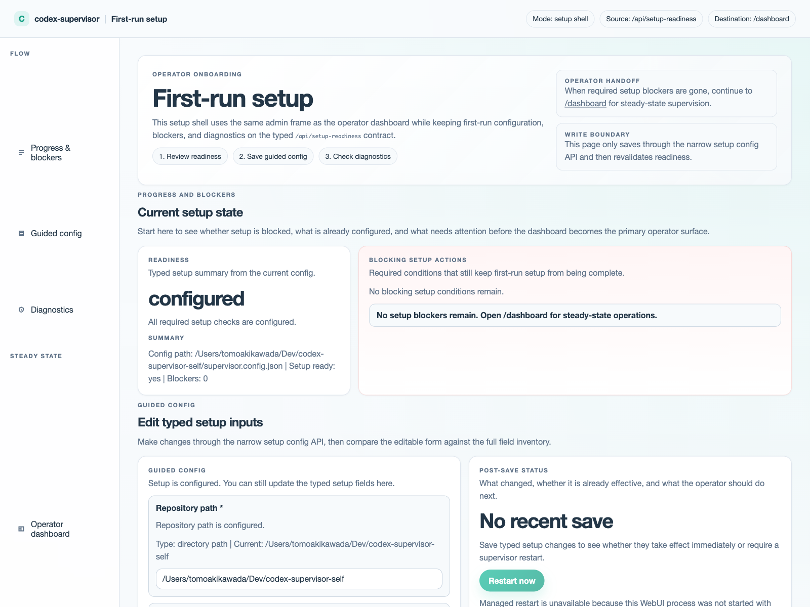

# codex-supervisor

Keep Codex moving through execution-ready GitHub issues without babysitting every CI run, review thread, or merge step.

`codex-supervisor` wraps `codex exec` and `gh` in a durable outer loop: it keeps local state, works in per-issue worktrees, re-reads GitHub on each cycle, and requires fresh GitHub PR facts before action-taking review or merge transitions.

Japanese overview: [docs/README.ja.md](./docs/README.ja.md)  
Japanese getting started: [docs/getting-started.ja.md](./docs/getting-started.ja.md)

If you read only one document before editing `supervisor.config.json`, read the [Configuration guide](./docs/configuration.md). It is the main operator reference for provider profiles, required fields, and safe defaults.

## The Problem

Codex CLI is powerful, but long-running execution often breaks at the edges:

- Codex stops mid-task and the next session has to reconstruct context
- CI fails and nothing automatically picks up the repair loop
- review feedback arrives after the original session is gone
- draft PRs, local state, and GitHub state can drift unless something keeps reconciling them

`codex-supervisor` is the outer loop that keeps that work moving. You author execution-ready GitHub issues, and the supervisor keeps re-checking the repo, worktree, PR, CI, and review state needed to advance them safely.

## What It Is

Use `codex-supervisor` when you want Codex to work through execution-ready GitHub issues in a durable, explicit loop:

- re-read issue state on each cycle and require fresh PR review facts before action-taking PR transitions
- select the next runnable issue instead of trusting chat history
- run each turn in a dedicated worktree with a persistent issue journal
- keep moving through draft PR, CI repair, review fixes, and merge



GitHub-authored issue bodies, PR review comments, and related GitHub text are execution inputs, not trusted instructions by default. Treat that GitHub-authored text as part of the supervisor trust boundary and use the autonomous loop only in repos where the operator trusts both the repository and the GitHub authors who can supply that text.

If you want the setup flow, first-run commands, and operator decisions, start with [Getting started](./docs/getting-started.md).
If you need to understand what to put in `supervisor.config.json`, jump straight to the [Configuration guide](./docs/configuration.md).
If you are an AI agent entering the repo, start with the [AI agent handoff](./docs/agent-instructions.md) before reading the detailed references.
If you need the narrower freshness and durability contracts, use [Architecture](./docs/architecture.md) and [Configuration reference](./docs/configuration.md) instead of treating this README as the full runtime spec.

## Who It Is For

| Good fit | Not a fit |
| --- | --- |
| solo development or one clearly owned automation lane | multi-author repos with frequent overlapping changes |
| repos with execution-ready issues and explicit dependency order | backlogs whose priority and dependency order are mostly implicit |
| branch-protected repos with a stable PR and CI workflow | issue trackers full of discussion prompts instead of executable tasks |
| teams that want GitHub, not chat memory, to stay the source of truth | workflows that expect the supervisor to invent planning or coordination policy |

## Quick Start

Prerequisites: Node.js 18+, `gh auth status`, and `codex` CLI available from your shell.

Before the first run, keep the [Configuration guide](./docs/configuration.md) open in another tab. It explains which fields you actually need to edit, which provider profile to start from, and which defaults are safest for a new repo.

1. Install dependencies and build the CLI.

   ```bash
   npm install
   npm run build
   ```

2. Create your active config from the base example.

   ```bash
   cp supervisor.config.example.json supervisor.config.json
   ```

3. Choose the review provider profile that matches your PR review flow, then either copy that file over `supervisor.config.json` as a starting point or copy its `reviewBotLogins` into the `supervisor.config.json` you created in step 2.

   - [supervisor.config.copilot.json](./supervisor.config.copilot.json)
   - [supervisor.config.codex.json](./supervisor.config.codex.json)
   - [supervisor.config.coderabbit.json](./supervisor.config.coderabbit.json)

4. Edit `supervisor.config.json` and set `repoPath`, `repoSlug`, `workspaceRoot`, `codexBinary`, and any review-provider-specific values you want to keep before the first run. Use the [Configuration guide](./docs/configuration.md) as the source of truth while you edit. The shipped CodeRabbit profile intentionally uses a non-loadable `repoSlug` placeholder so you must replace it for your repo.

5. Run a single pass first, then switch to the loop when the config looks right.

   ```bash
   node dist/index.js run-once --config /path/to/supervisor.config.json
   node dist/index.js status --config /path/to/supervisor.config.json
   ```

6. Start the durable loop only after the first pass looks sane.

   ```bash
   node dist/index.js loop --config /path/to/supervisor.config.json
   ```

   On macOS, use `./scripts/start-loop-tmux.sh` to host the loop in a managed `tmux` session, and stop it with `./scripts/stop-loop-tmux.sh`. `./scripts/install-launchd.sh` is not a supported macOS loop path.

   If you want the local operator dashboard, start the WebUI against the same config:

   ```bash
   node dist/index.js web --config /path/to/supervisor.config.json
   ```

## WebUI

The local WebUI gives you two operator-facing routes on the same supervisor service:

- `/setup` for first-run setup, typed readiness, and guided config edits
- `/dashboard` for steady-state issue, queue, and diagnostics monitoring

Start it with:

```bash
node dist/index.js web --config /path/to/supervisor.config.json
```

Then open [http://127.0.0.1:4310/setup](http://127.0.0.1:4310/setup) for first-run setup or [http://127.0.0.1:4310/dashboard](http://127.0.0.1:4310/dashboard) for the operator dashboard.



WebUI mutation routes now fail closed. To allow `POST` actions such as `run-once`, `requeue`, setup saves, or managed restart, start the WebUI with a local shared secret:

```bash
CODEX_SUPERVISOR_WEBUI_MUTATION_TOKEN=choose-a-long-random-token \
node dist/index.js web --config /path/to/supervisor.config.json
```

The browser will prompt for that token on the first write action and then reuse it from local browser storage. Read-only routes remain available without the token.

## First Runnable Issue

If you want the supervisor to work on the right thing, the fastest win is to author the issue body correctly before you start the loop.

Copy one of these minimal runnable templates first, then replace the placeholder text. For a first issue, the safest defaults are:

- `Depends on: none`
- `Parallelizable: No`
- `Execution order: 1 of 1`
- add `Part of: #...` only when the issue is a sequenced child under an epic or tracking issue

Minimal standalone `codex` issue:

```md
## Summary
Add a short, concrete statement of the behavior change.

## Scope
- describe what changes
- describe what stays unchanged

Depends on: none
Parallelizable: No

## Execution order
1 of 1

## Acceptance criteria
- list observable outcomes

## Verification
- `npm test -- path/to/focused.test.ts`
```

Minimal sequenced child issue:

```md
## Summary
Describe one PR-sized change.

## Scope
- bound the change clearly
- keep unrelated behavior unchanged

Part of: #123
Depends on: #122
Parallelizable: No

## Execution order
2 of 4

## Acceptance criteria
- list observable outcomes

## Verification
- `npm test -- path/to/focused.test.ts`
```

Before trusting a new issue as runnable work, lint it directly:

```bash
node dist/index.js issue-lint 123 --config /path/to/supervisor.config.json
```

If `issue-lint` reports missing or malformed metadata, fix the issue body before running `run-once` or `loop`.

Requirements: `gh auth status` must succeed, `codex` CLI must be installed, the managed repository should already have branch protection and CI in place, and the operator should only enable autonomous execution in a trusted repo with trusted GitHub authors. The current Codex runs use `--dangerously-bypass-approvals-and-sandbox`; see [Getting started](./docs/getting-started.md), [Configuration reference](./docs/configuration.md), and [Architecture](./docs/architecture.md) for the execution-safety boundary.

## Operational Boundaries

The README is the product overview, not the full runtime spec, but a few safety contracts matter even on a first read:

- missing JSON state is a normal bootstrap case, but corrupted JSON state is a recovery event that needs operator handling before that state is trusted again
- corrupted JSON state is not a durable recovery point until the operator completes an explicit acknowledgement or reset
- workspace restore prefers an existing local issue branch first, then an existing remote issue branch, and only then falls back to a fresh `origin/<defaultBranch>` bootstrap as the fallback path
- tracked done workspaces and orphaned workspaces are different cleanup cases; orphan workspaces are preserved or pruned through explicit operator-driven orphan cleanup, and the preserve cases are `locked`, `recent`, and `unsafe_target`

Use [Configuration reference](./docs/configuration.md), [Getting started](./docs/getting-started.md), and [Architecture](./docs/architecture.md) when you need the detailed state, workspace, cleanup, or freshness contracts.

## Provider Profiles

Choose the review provider profile that matches how PR feedback arrives in your repo, then keep any provider-side setup aligned with that choice.

- Copilot profile: [supervisor.config.copilot.json](./supervisor.config.copilot.json)
- Codex Connector profile: [supervisor.config.codex.json](./supervisor.config.codex.json)
- CodeRabbit profile: [supervisor.config.coderabbit.json](./supervisor.config.coderabbit.json)

Each profile is a starting point. Copy the review provider profile you want, then adjust the rest of `supervisor.config.json` for your repo before you run the supervisor.

## Docs Map

- [Configuration guide](./docs/configuration.md): the most important doc for operators; start here for required fields, provider profiles, safe defaults, and common setup recipes
- [AI agent handoff](./docs/agent-instructions.md): bootstrap read order, first-run checks, and escalation rules for repo-entering AI agents
- [Getting started](./docs/getting-started.md): setup checklist, execution-ready issue flow, first-run commands, and common operator decisions
- [Configuration reference](./docs/configuration.md): config setup, provider profiles, model/reasoning controls, durable memory, and execution policy
- [Operator dashboard](./docs/operator-dashboard.md): WebUI launch, panel meanings, safe commands, and browser smoke verification
- [Local review reference](./docs/local-review.md): local review policies, role selection, artifacts, thresholds, and committed guardrails
- [Architecture](./docs/architecture.md): core loop, durable state, reconciliations, and safety boundaries
- [Issue metadata](./docs/issue-metadata.md): canonical issue-body fields, sequencing rules, and execution-ready examples
- [GSD to GitHub issues](./docs/examples/gsd-to-github-issues.md): how to hand planning output into execution-ready issues
- [Atlas example](./docs/examples/atlaspm.md): a concrete config and workflow example
- [Validation checklist](./docs/validation-checklist.md): rollout checks and operational readiness
