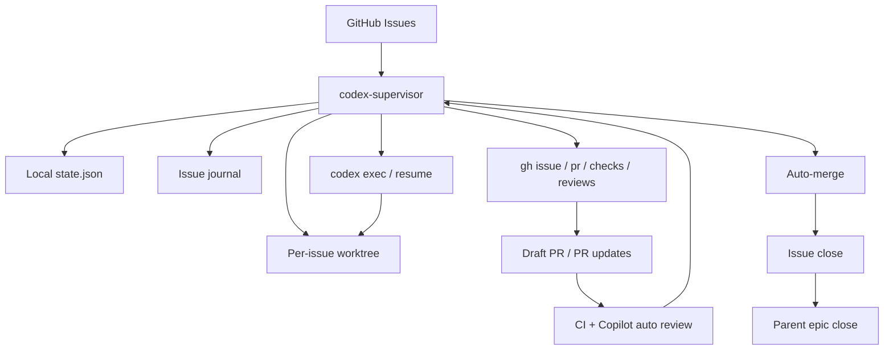

# codex-supervisor

Minimal GitHub issue/PR/CI supervisor for `codex exec` and `gh`.

The design goal is small, durable orchestration:

- GitHub is the source of truth
- the supervisor keeps local persistent state
- each Codex turn is a fresh `codex exec` or `codex exec resume`
- after every turn, the supervisor re-reads issue, PR, checks, reviews, and mergeability from GitHub

This keeps loop continuity outside the chat thread.

## Architecture



The supervisor itself is intentionally small. It decides the next action from GitHub facts plus local state, not from long-lived chat memory.

## Current scope

- one managed repository per config
- one active issue at a time
- per-issue worktree
- JSON state store
- GitHub operations via `gh`
- Codex execution via `codex exec`

## Best fit

- solo development, or a single clearly-owned automation lane inside a small team
- repositories where issue order and dependencies are explicitly written down
- repos with branch protection, required checks, and a stable PR workflow
- work that can be decomposed into implementation-sized GitHub issues
- teams that want GitHub to remain the source of truth instead of chat history

## Not a fit

- fast-moving multi-author repos where multiple people frequently touch the same area at once
- backlogs where issue priority and dependency order are mostly implicit
- projects that rely on long design discussions inside PRs before code can proceed
- repos where issues are vague prompts rather than execution-ready work items
- workflows that expect the supervisor to invent prioritization, architecture, or team coordination policy on its own

## Run states

- `queued`
- `planning`
- `reproducing`
- `implementing`
- `stabilizing`
- `draft_pr`
- `pr_open`
- `repairing_ci`
- `resolving_conflict`
- `waiting_ci`
- `addressing_review`
- `ready_to_merge`
- `merging`
- `done`
- `blocked`
- `failed`

`blocked` also records `blocked_reason`, currently one of:

- `requirements`
- `permissions`
- `secrets`
- `verification`
- `manual_review`
- `manual_pr_closed`
- `handoff_missing`
- `unknown`

## Requirements

- `gh auth status` succeeds
- `codex` CLI is installed
- the managed repository already has branch protection / merge policy configured
- the managed repository is cloned locally

## Configuration

Create `supervisor.config.json` from [supervisor.config.example.json](./supervisor.config.example.json).

Important fields:

- `repoPath`: absolute path to the managed repository
- `repoSlug`: `OWNER/REPO`
- `workspaceRoot`: directory used for per-issue worktrees
- `stateBackend`: `json` or `sqlite`
- `stateFile`: local JSON state file
- `stateBootstrapFile`: optional JSON file to import once when initializing a SQLite state database
- `codexBinary`: path to the Codex CLI
- `sharedMemoryFiles`: durable repo-memory files to reference every turn
- `localReviewEnabled`: run an advisory local review before a draft PR is marked ready
- `localReviewRoles`: role labels to suggest when Codex multi-agent review is available
- `localReviewArtifactDir`: directory for generated local review artifacts
- `reviewBotLogins`: bot reviewer logins that the supervisor may auto-address
- `humanReviewBlocksMerge`: if `true`, unresolved human or unconfigured-bot review threads stop auto-merge and require manual intervention
- `issueJournalRelativePath`: per-issue handoff journal inside each worktree
- `issueJournalMaxChars`: compaction budget for the journal handoff section
- `issueLabel`: optional issue label filter
- `issueSearch`: optional GitHub issue search query
- `skipTitlePrefixes`: optional title prefixes to exclude, for example `["Epic:"]`
- `branchPrefix`: branch prefix, usually `codex/issue-`
- `copilotReviewWaitMinutes`: grace period after a PR becomes ready or gets a new head SHA
- `codexExecTimeoutMinutes`: per-turn timeout
- `maxCodexAttemptsPerIssue`: total Codex-turn budget per issue
- `timeoutRetryLimit`: timeout-only retry budget
- `blockedVerificationRetryLimit`: retry budget for verification blockers
- `sameBlockerRepeatLimit`: repeated-blocker stop limit
- `sameFailureSignatureRepeatLimit`: repeated failure-signature stop limit
- `cleanupDoneWorkspacesAfterHours`: cleanup delay for done worktrees
- `mergeMethod`: `merge`, `squash`, or `rebase`
- `draftPrAfterAttempt`: attempt number after which a clean checkpoint may become a draft PR

## Durable memory

Codex threads do not automatically share conversation history. This supervisor treats repo files as the durable shared memory.

Typical files:

- `README.md`
- `docs/architecture.md`
- `docs/constitution.md`
- `docs/workflow.md`
- `docs/decisions.md`

The supervisor also keeps a per-issue journal in each worktree. Codex is required to update that journal before ending a turn.

To keep token usage small and deterministic, the supervisor also generates:

- a compact context index outside the managed repo
- an `AGENTS.generated.md` file outside the managed repo

These generated files tell Codex what to read first and which durable memory files are only on-demand.

### Memory read policy

- always read:
  - `AGENTS.generated.md`
  - the compact context index
  - the current issue journal
- read on demand:
  - `README.md`
  - architecture / workflow / decisions docs
  - any other shared memory files listed in config

The goal is to avoid bulk-reading every durable memory file on every turn while still preserving cross-session memory.

Template shared-memory files are included here:

- [docs/shared-memory/constitution.example.md](./docs/shared-memory/constitution.example.md)
- [docs/shared-memory/workflow.example.md](./docs/shared-memory/workflow.example.md)
- [docs/shared-memory/decisions.example.md](./docs/shared-memory/decisions.example.md)

## State backends

The default state backend is JSON, but SQLite is also supported.

- JSON: simple and easy to inspect, good for local prototypes
- SQLite: better for schema evolution, recovery, and public/general use

To switch to SQLite, set:

```json
{
  "stateBackend": "sqlite",
  "stateFile": "./.local/state.sqlite"
}
```

If you already have JSON state and want a one-time bootstrap into SQLite, also set:

```json
{
  "stateBackend": "sqlite",
  "stateFile": "./.local/state.sqlite",
  "stateBootstrapFile": "./.local/state.json"
}
```

On first load, the supervisor imports the JSON state into SQLite if the SQLite database is empty.

## Issue metadata

For safe sequencing, put explicit metadata in issue bodies. Supported fields are documented in [docs/issue-metadata.md](./docs/issue-metadata.md).

Currently enforced:

- `Depends on: #123, #124`
- `Part of #...`
- `## Execution order`

Example issue body:

```md
## Summary

Persist timeline row layout separately for each swimlane mode.

## Scope

- save manual row layout for `section`
- save manual row layout for `assignee`
- save manual row layout for `status`
- keep existing section behavior unchanged

Depends on: #232
Part of #227
Parallelizable: No

## Execution order

7 of 15

## Acceptance criteria

- switching between `section`, `assignee`, and `status` restores each mode's own saved layout
- existing timeline reorder tests still pass
- a focused E2E covers cross-mode persistence
```

Practical guidance:

- keep one execution-ready change per issue
- write `Depends on` whenever a later issue would be unsafe without an earlier one
- use `Part of` for epics or parent rollups
- use `Execution order` when a series must be processed in a specific sequence
- if parallel execution is safe, say so explicitly in the issue body instead of expecting the supervisor to infer it

## Commands

```bash
npm install
npm run build
node dist/index.js status
node dist/index.js run-once
node dist/index.js loop
```

`status` is intended to be the first place to look during operations. It reports the active issue, current state, retry counters, failure signature, and live PR/check/review context when a PR exists. If there is no active issue, it reports the latest tracked record instead of only printing an empty state.

## Using Codex as an operator console

Many teams use Codex itself as the human-facing entry point for the supervisor. That is a good fit for this project.

In that operating model:

- `codex-supervisor` is the execution engine
- Codex CLI or Codex App is the operator console

Typical operator requests look like:

- `Build the supervisor and start working atlaspm issues.`
- `Report the current supervisor status.`
- `Requeue issue #123.`
- `Show why the current PR is blocked.`

This is useful because humans can interact in natural language while the supervisor remains a small deterministic state machine over GitHub, local state, worktrees, and `codex exec`.

Recommended boundaries:

- let the supervisor own state, locks, worktrees, and GitHub mutations
- let Codex handle operator requests, inspection, and one-off interventions
- do not treat the chat thread as the source of truth
- prefer `status` plus the state file and GitHub facts when answering operational questions

If you run the supervisor this way, keep the service model simple:

- one long-running `loop` process per config
- optional operator-triggered `run-once` calls only when the global supervisor lock says it is safe
- no assumption that Codex chat history is shared across machines or sessions

## Local review

`codex-supervisor` can optionally run a local advisory review before a draft PR is marked ready.

This is designed to reduce dependence on GitHub-hosted auto review. The supervisor:

- waits until the draft PR is green and conflict-free
- runs a separate local review turn with Codex
- suggests reviewer roles such as `reviewer`, `explorer`, and `docs_researcher`
- keeps the same context-budget policy used by implementation turns: read the compact context index and issue journal first, then open durable memory files only on demand
- saves artifacts under `localReviewArtifactDir`
- then continues the normal ready / Copilot wait flow

This review is advisory by default. It does not mutate code and it does not block merge unless you later add your own gating policy around the saved artifacts.

## Runtime

### macOS

Install as a user LaunchAgent:

```bash
./scripts/install-launchd.sh
launchctl print gui/$(id -u)/io.codex.supervisor
```

### Linux

Install as a user systemd service:

```bash
./scripts/install-systemd.sh
systemctl --user status codex-supervisor.service
```

Both installers render a local service file from templates and inject the current repo root, `node`, `npm`, and `PATH`.

## Safety model

- never pushes directly to the default branch
- acquires a global supervisor lock for every `run-once` / loop cycle before mutating state
- uses issue-specific branches only
- relies on branch protection for merge safety
- uses issue locks and session locks to avoid duplicate turns
- requires issue-journal handoff before accepting a Codex turn
- waits for Copilot auto review before merge
- only auto-addresses review threads from configured bot reviewers
- treats unresolved human or unconfigured-bot review threads as manual blockers when configured
- handles CI repair, review response, and merge-conflict resolution as separate phases
- closes merged issues automatically
- closes parent epic issues automatically when every child issue is closed

If another supervisor process is already active, extra `loop` or `run-once` invocations do not mutate state. They log a skip message and rely on stale-lock cleanup if the previous process died unexpectedly.

## Current limitations

- single state backend per config file
- single active issue only
- GitHub-specific workflow assumptions
- no built-in multi-repo scheduler yet

## Validation

The validation checklist used for the original end-to-end proving loop is in [docs/validation-checklist.md](./docs/validation-checklist.md).

Example material:

- managed-repo walkthrough: [docs/examples/atlaspm.md](./docs/examples/atlaspm.md)
- concrete config file: [docs/examples/atlaspm.supervisor.config.example.json](./docs/examples/atlaspm.supervisor.config.example.json)
- architecture notes: [docs/architecture.md](./docs/architecture.md)
