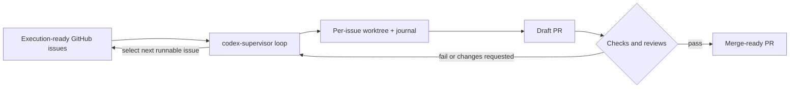

# codex-supervisor

Codex Supervisor turns vibe coding into issue-driven, test-backed, reviewable software delivery.

It is an AI coding quality layer around `codex exec` and `gh`: you give it execution-ready GitHub issues, and it keeps the work moving through local verification, PR review, CI repair, and evidence capture without treating chat memory as the source of truth.

Japanese overview: [docs/README.ja.md](./docs/README.ja.md)  
Japanese getting started: [docs/getting-started.ja.md](./docs/getting-started.ja.md)

If you read only one document before editing `supervisor.config.json`, read the [Configuration guide](./docs/configuration.md). It is the main operator reference for provider profiles, required fields, and safe defaults.

## What It Is

The first-screen loop is deliberately small:

- issue contract: the [issue body contract](./docs/issue-body-contract.schema.json) and [Issue metadata](./docs/issue-metadata.md) define what makes a GitHub issue runnable
- local verification: the configured commands prove the change inside the worktree before the supervisor can advance it
- reviewable PR: each issue runs on its own branch and draft PR so CI, configured review providers, and humans can inspect the work
- evidence timeline: the [evidence timeline](./docs/evidence-timeline.schema.json) records what happened for later audit, recovery, and handoff

The related primitive artifacts are intentionally linked instead of re-explained here: [trust posture](./docs/trust-posture-config.schema.json), [operator actions](./docs/operator-actions.schema.json), [automation boundary](./docs/codex-automation-connector-boundary.schema.json), [Architecture](./docs/architecture.md), and [Codex app Automation boundary](./docs/automation.md).

Use `codex-supervisor` when you want Codex to work through execution-ready GitHub issues in a durable, explicit loop:

- re-read issue state on each cycle and require fresh GitHub PR facts before action-taking PR transitions
- select the next runnable issue instead of trusting chat history
- run each turn in a dedicated worktree with a persistent issue journal
- keep moving through draft PR, CI repair, review fixes, and merge



GitHub-authored issue bodies, PR review comments, and related GitHub text are execution inputs, not trusted instructions by default. Treat that GitHub-authored text as part of the supervisor trust boundary and use the autonomous loop only in repos where the operator trusts both the repository and the GitHub authors who can supply that text.

If you want the setup flow, first-run commands, and operator decisions, start with [Getting started](./docs/getting-started.md).
If you want a disposable first supervised pass before production use, follow the [Playground smoke run](./docs/playground-smoke-run.md).
If you need to understand what to put in `supervisor.config.json`, jump straight to the [Configuration guide](./docs/configuration.md).
If you are an AI agent entering the repo, start with the [AI agent handoff](./docs/agent-instructions.md) before reading the detailed references.
If you need the compact public primitive map, read the [AI coding quality kit](./docs/quality-kit.md).
If you need the product primitive framing for the supervised lane beside chat-driven Codex work, read the [Supervised automation lane](./docs/supervised-automation-lane.md) note.
If you want the same small change shown as an unstructured session versus a supervised loop, read the [Before / After narrative](./docs/vibe-coding-before-after.md).
If you want to see the supervised PR lifecycle annotated with Phase 16's own dogfooding flow, read the [Phase 16 dogfood PR walkthrough](./docs/examples/phase-16-dogfood-pr-walkthrough.md).
If you need the narrower freshness and durability contracts, use [Architecture](./docs/architecture.md) and [Configuration reference](./docs/configuration.md) instead of treating this README as the full runtime spec.
If you use Codex app Automation around the loop, keep the [Codex app Automation boundary](./docs/automation.md) as the repo-owned contract: Automation orchestrates and records, while `codex-supervisor` remains the implementation executor.

## Who It Is For

| Good fit | Not a fit |
| --- | --- |
| solo development or one clearly owned automation lane | multi-author repos with frequent overlapping changes |
| repos with execution-ready issues and explicit dependency order | backlogs whose priority and dependency order are mostly implicit |
| branch-protected repos with a stable PR and CI workflow | issue trackers full of discussion prompts instead of executable tasks |
| teams that want GitHub, not chat memory, to stay the source of truth | workflows that expect the supervisor to invent planning or coordination policy |

## Quick Start

Prerequisites: Node.js 18+, `gh auth status`, and `codex` CLI available from your shell.

Start with the [Playground smoke run](./docs/playground-smoke-run.md) when you want a 5-minute first supervised pass before pointing the supervisor at production work. The playground path uses a disposable repo or fork, one harmless `codex` issue, and one explicit config file.

1. Install dependencies and build the CLI.

   ```bash
   npm install
   npm run build
   ```

2. Create a playground config.

   ```bash
   cp supervisor.config.example.json supervisor.config.playground.json
   ```

3. Edit `supervisor.config.playground.json` for the sandbox repo, then use one config variable for the smoke commands.

   ```bash
   export CODEX_SUPERVISOR_CONFIG=<supervisor-config-path>
   ```

   At minimum, set `repoPath`, `repoSlug`, `workspaceRoot`, `codexBinary`, `trustMode`, and `executionSafetyMode`. Use the [Configuration guide](./docs/configuration.md) for full setup, provider profiles, model routing, and production-safe defaults.

4. Create one sandbox GitHub issue with the `codex` label using the sample body in the [Playground smoke run](./docs/playground-smoke-run.md). For real work, follow the [Issue metadata](./docs/issue-metadata.md) reference before starting the supervisor.

5. Validate the issue body and inspect the host/config posture before Codex runs.

   ```bash
   node dist/index.js help
   node dist/index.js doctor --config "$CODEX_SUPERVISOR_CONFIG"
   node dist/index.js status --config "$CODEX_SUPERVISOR_CONFIG" --why
   node dist/index.js issue-lint <issue-number> --config "$CODEX_SUPERVISOR_CONFIG"
   ```

6. Run a dry run, then one supervised pass.

   ```bash
   node dist/index.js run-once --config "$CODEX_SUPERVISOR_CONFIG" --dry-run
   node dist/index.js run-once --config "$CODEX_SUPERVISOR_CONFIG"
   node dist/index.js status --config "$CODEX_SUPERVISOR_CONFIG" --why
   ```

Stop after one successful `run-once`. Inspect the sandbox repo, issue journal, and any draft PR before you operate on production work.

Only use autonomous execution in a trusted repo with trusted GitHub authors. Current Codex runs use `--dangerously-bypass-approvals-and-sandbox`, so the production trust posture belongs in the config and operator process before background execution starts. Use [Getting started](./docs/getting-started.md), the [Configuration guide](./docs/configuration.md), the [trust mode and execution safety mode combinations](./docs/configuration.md#trust-mode-and-execution-safety-mode-combinations), and [Architecture](./docs/architecture.md) for the full execution-safety boundary.

When the sandbox pass is clean, validate the production config and a real issue before starting the loop:

   ```bash
   node dist/index.js issue-lint <issue-number> --config <supervisor-config-path>
   node dist/index.js doctor --config <supervisor-config-path>
   node dist/index.js status --config <supervisor-config-path> --why
   node dist/index.js loop --config <supervisor-config-path>
   ```

For a shipped provider profile, choose the command block that matches the copied profile you are validating:

   ```bash
   node dist/index.js issue-lint <issue-number> --config supervisor.config.copilot.json
   node dist/index.js doctor --config supervisor.config.copilot.json
   node dist/index.js status --config supervisor.config.copilot.json --why

   node dist/index.js issue-lint <issue-number> --config supervisor.config.codex.json
   node dist/index.js doctor --config supervisor.config.codex.json
   node dist/index.js status --config supervisor.config.codex.json --why

   node dist/index.js issue-lint <issue-number> --config supervisor.config.coderabbit.json
   node dist/index.js doctor --config supervisor.config.coderabbit.json
   node dist/index.js status --config supervisor.config.coderabbit.json --why

   node dist/index.js issue-lint <issue-number> --config supervisor.config.typescript-node.json
   node dist/index.js doctor --config supervisor.config.typescript-node.json
   node dist/index.js status --config supervisor.config.typescript-node.json --why

   node dist/index.js issue-lint <issue-number> --config supervisor.config.nextjs.json
   node dist/index.js doctor --config supervisor.config.nextjs.json
   node dist/index.js status --config supervisor.config.nextjs.json --why
   ```

On macOS, use `./scripts/start-loop-tmux.sh` to host the loop in a managed `tmux` session, and stop it with `./scripts/stop-loop-tmux.sh`. `./scripts/install-launchd.sh` is not a supported macOS loop path. The tmux scripts use `CODEX_SUPERVISOR_CONFIG`; keep it pointed at the config you validated.

If you want the local operator dashboard, start the WebUI against the same config:

```bash
node dist/index.js web --config <supervisor-config-path>
```

The WebUI is an operator surface over the same supervisor service. It does not own the background loop or create a loop run mode; use `status` or `doctor` to inspect the observable loop runtime marker.

## WebUI

The local WebUI gives you two operator-facing routes on the same supervisor service:

- `/setup` for first-run setup, typed readiness, and guided config edits
- `/dashboard` for steady-state issue, queue, and diagnostics monitoring

It observes and mutates through the supervisor service boundary, but it is not the loop owner. A launcher-managed WebUI restart only relaunches the WebUI process; the background loop remains owned by the supported tmux or systemd loop host.

Start it with:

```bash
node dist/index.js web --config <supervisor-config-path>
```

Then open [http://127.0.0.1:4310/setup](http://127.0.0.1:4310/setup) for first-run setup or [http://127.0.0.1:4310/dashboard](http://127.0.0.1:4310/dashboard) for the operator dashboard.


WebUI mutation routes now fail closed. To allow `POST` actions such as `run-once`, `requeue`, setup saves, or managed restart, start the WebUI with a local shared secret:

```bash
CODEX_SUPERVISOR_WEBUI_MUTATION_TOKEN=choose-a-long-random-token \
node dist/index.js web --config <supervisor-config-path>
```

The browser will prompt for that token on the first write action and then reuse it from local browser storage. Read-only routes remain available without the token.

## First Runnable Issue

If you want the supervisor to work on the right thing, the fastest win is to author the issue body correctly before you start the loop.

Copy one of these minimal runnable templates first, then replace the placeholder text. For a first issue, the safest defaults are:

- `Depends on: none`
- `Parallelizable: No`
- `Execution order: 1 of 1`
- add `Part of: #...` only when the issue is a sequenced child under an epic or tracking issue

Minimal standalone `codex` issue:

```md
## Summary
Add a short, concrete statement of the behavior change.

## Scope
- describe what changes
- describe what stays unchanged

Depends on: none
Parallelizable: No

## Execution order
1 of 1

## Acceptance criteria
- list observable outcomes

## Verification
- `npm test -- path/to/focused.test.ts`
```

Minimal sequenced child issue:

```md
## Summary
Describe one PR-sized change.

## Scope
- bound the change clearly
- keep unrelated behavior unchanged

Part of: #123
Depends on: #122
Parallelizable: No

## Execution order
2 of 4

## Acceptance criteria
- list observable outcomes

## Verification
- `npm test -- path/to/focused.test.ts`
```

Before trusting a new issue as runnable work, lint it directly:

```bash
node dist/index.js issue-lint <issue-number> --config <supervisor-config-path>
```

If `issue-lint` reports missing or malformed metadata, fix the issue body before running `run-once` or `loop`.

Requirements: `gh auth status` must succeed, `codex` CLI must be installed, the managed repository should already have branch protection and CI in place, and the operator should only enable autonomous execution in a trusted repo with trusted GitHub authors. The current Codex runs use `--dangerously-bypass-approvals-and-sandbox`; see [Getting started](./docs/getting-started.md), [Configuration reference](./docs/configuration.md), the [trust mode and execution safety mode combinations](./docs/configuration.md#trust-mode-and-execution-safety-mode-combinations), and [Architecture](./docs/architecture.md) for the execution-safety boundary.

## Operational Boundaries

The README is the product overview, not the full runtime spec, but a few safety contracts matter even on a first read:

- missing JSON state is a normal bootstrap case, but corrupted JSON state is a recovery event that needs operator handling before that state is trusted again
- corrupted JSON state is not a durable recovery point until the operator completes an explicit acknowledgement or reset
- workspace restore prefers an existing local issue branch first, then an existing remote issue branch, and only then falls back to a fresh `origin/<defaultBranch>` bootstrap as the fallback path
- tracked done workspaces and orphaned workspaces are different cleanup cases; orphan workspaces are preserved or pruned through explicit operator-driven orphan cleanup, and the preserve cases are `locked`, `recent`, and `unsafe_target`

Use [Configuration reference](./docs/configuration.md), [Getting started](./docs/getting-started.md), and [Architecture](./docs/architecture.md) when you need the detailed state, workspace, cleanup, or freshness contracts.

## Provider Profiles

Choose the review provider profile that matches how PR feedback arrives in your repo, then keep any provider-side setup aligned with that choice.

- Copilot profile: [supervisor.config.copilot.json](./supervisor.config.copilot.json)
- Codex Connector profile: [supervisor.config.codex.json](./supervisor.config.codex.json)
- CodeRabbit profile: [supervisor.config.coderabbit.json](./supervisor.config.coderabbit.json)
- TypeScript/Node starter profile: [supervisor.config.typescript-node.json](./supervisor.config.typescript-node.json), with setup notes and a first issue example in [TypeScript and Node starter profile](./docs/examples/typescript-node.md)
- Next.js starter profile: [supervisor.config.nextjs.json](./supervisor.config.nextjs.json), with npm local CI mapping and a first issue example in [Next.js starter profile](./docs/examples/nextjs.md)

Each profile is a starting point. Copy the review provider profile you want, then adjust the rest of `supervisor.config.json` for your repo before you run the supervisor.

The active config is whichever file you pass with `--config`. If you keep several profiles side by side, verify the intended one with:

```bash
node dist/index.js status --config <supervisor-config-path>
node dist/index.js doctor --config <supervisor-config-path>
```

Recommended model posture for those profiles:

- keep `codexModelStrategy: "inherit"` so the supervisor follows the host Codex default model
- set the host Codex default model intentionally
- use `fixed` only when one profile must pin a model and ignore the host default model

Use the [Configuration guide](./docs/configuration.md) for the full routing rules and validation details.

## Docs Map

- [Configuration guide](./docs/configuration.md): the most important doc for operators; start here for required fields, provider profiles, safe defaults, and common setup recipes
- [AI agent handoff](./docs/agent-instructions.md): bootstrap read order, first-run checks, and escalation rules for repo-entering AI agents
- [Getting started](./docs/getting-started.md): setup checklist, execution-ready issue flow, first-run commands, and common operator decisions
- [Playground smoke run](./docs/playground-smoke-run.md): sandbox-only first supervised pass, sample issue body, and smoke commands
- [Configuration reference](./docs/configuration.md): config setup, provider profiles, model/reasoning controls, durable memory, and execution policy
- [Operator dashboard](./docs/operator-dashboard.md): WebUI launch, panel meanings, safe commands, and browser smoke verification
- [Local review reference](./docs/local-review.md): local review policies, role selection, artifacts, thresholds, and committed guardrails
- [AI coding quality kit](./docs/quality-kit.md): compact primitive map for the issue contract, local verification gate, prompt safety boundary, evidence timeline, operator action, and durable history writeback
- [Supervised automation lane](./docs/supervised-automation-lane.md): product primitive contract for issue/spec-driven supervised automation beside Codex chat
- [Before / After narrative](./docs/vibe-coding-before-after.md): the same small change compared as an unstructured session and a supervised loop
- [Phase 16 dogfood PR walkthrough](./docs/examples/phase-16-dogfood-pr-walkthrough.md): annotated supervised PR lifecycle from the repo's own demo-material phase using sanitized public-safe placeholders
- [Public demo validation checklist](./docs/public-demo-validation-checklist.md): maintainer checklist for keeping public demo assets current, safe, and linked to current schema artifacts
- [Architecture](./docs/architecture.md): core loop, durable state, reconciliations, and safety boundaries
- [Issue metadata](./docs/issue-metadata.md): canonical issue-body fields, sequencing rules, and execution-ready examples
- [Self-contained demo scenario](./docs/examples/self-contained-demo-scenario.md): publishable walkthrough artifact with a realistic issue body, expected verification, PR outcome, and evidence timeline references
- [GSD to GitHub issues](./docs/examples/gsd-to-github-issues.md): how to hand planning output into execution-ready issues
- [Atlas example](./docs/examples/atlaspm.md): a concrete config and workflow example
- [Release readiness checklist](./docs/validation-checklist.md): advisory minimum, recommended, and sufficient release-readiness checks
