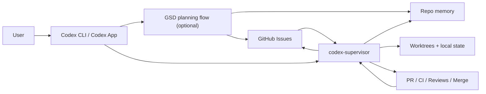
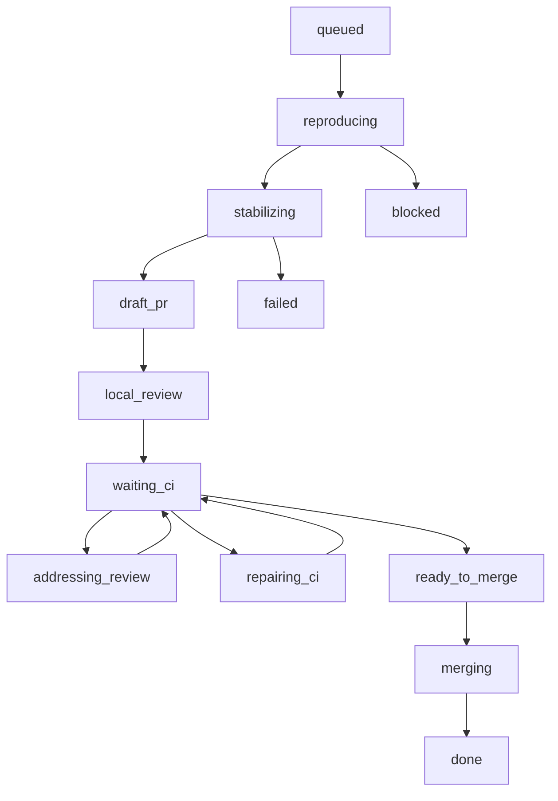

# codex-supervisor 日本語ガイド

`codex-supervisor` は、`codex exec` と `gh` を使って GitHub Issues / PR / CI / review / merge のループを継続するための、**deterministic で durable な supervisor** です。

英語版の一次ソースは [README.md](/Users/tomoakikawada/Dev/codex-supervisor/README.md) です。この文書は、日本語で全体像と運用モデルを素早く把握するためのガイドです。

## 何を目指すか

`codex-supervisor` の中心思想は次の 3 つです。

- GitHub を source of truth にする
- chat thread の長期記憶に依存しない
- 状態遷移とローカル state によって loop を継続する

つまり、長い会話を維持して作業を続けるのではなく、毎ターン

- issue
- PR
- checks
- review threads
- mergeability

を GitHub から再取得し、次に取るべき行動を決めます。

## 何が嬉しいか

- issue 駆動で実装を進められる
- PR 作成後の CI 待ち、review 待ち、修正、再 push を loop として扱える
- local state があるので、会話コンテキスト圧縮で止まりにくい
- readiness-driven に次の runnable issue を選べる

## 何をしないか

- GitHub 以外の曖昧な優先順位付けを勝手に発明しない
- 長い設計議論を supervisor 自身が持ち続けない
- repo 固有の workflow を自動で推測し切ることを期待しない

## 向いているケース

- 1 人開発、または小規模で ownership が明確な automation lane
- `Depends on` や `Execution order` が issue に書かれている repo
- branch protection と CI が整っている repo
- execution-ready な issue を順番に回したい repo

## 向いていないケース

- 多人数が同じ領域を頻繁に触る repo
- issue の優先順位や依存関係が暗黙な backlog
- issue が相談単位で、実装単位に分解されていない repo

## 全体像

ポイントは次です。

- 出発点は常に `User -> Codex`
- GSD は optional な planning tool
- `codex-supervisor` は execution engine

## readiness-driven scheduling

`codex-supervisor` は単純な「新しい issue が立ったら取る」仕組みではありません。

本質は **今 runnable な issue を選ぶこと** です。

そのため、毎 poll で次を見ます。

- issue が open か
- label / search 条件に合うか
- `Depends on` が解消されているか
- `Execution order` 上、前段 issue が終わっているか
- local state が `blocked` / `failed` のままではないか
- 関連 PR / checks / review が stale ではないか

これにより、Epic と複数の子 issue をまとめて open する運用でも、先に進めるべき issue だけを選べます。

## 主な状態遷移

補足:

- `reproducing`: 問題や要件を再現可能な形に寄せる
- `stabilizing`: checkpoint を clean にして PR 可能な形へ寄せる
- `local_review`: ローカル review swarm を回す
- `repairing_ci`: CI failure 修正
- `addressing_review`: bot review 対応

## local review swarm

`codex-supervisor` は、draft PR を ready にする前後でローカル review swarm を回せます。

主な特徴:

- role ごとに別 Codex turn を実行
- Markdown と JSON artifact を保存
- confidence threshold 以上の finding を actionable として扱う
- policy に応じて `block_ready` / `block_merge` ができる

代表的な role:

- `reviewer`
- `explorer`
- `docs_researcher`
- `prisma_postgres_reviewer`
- `migration_invariant_reviewer`
- `contract_consistency_reviewer`
- `ui_regression_reviewer`

`localReviewRoles` を空にし、`localReviewAutoDetect: true` にすると、repo 構成から specialist role を自動選択できます。

## model / reasoning の考え方

現状の推奨は次です。

- model は基本 `inherit`
- Codex CLI / App 側の default model を `GPT-5.4` にする
- 最適化は model 切り替えより reasoning effort の調整で行う

`xhigh` は常用せず、例外的な repeated failure の escalation 用に残す方がよいです。

## GSD との関係

GSD は daily execution loop の中核ではありません。役割分担は次です。

- GSD: 上流の planning
- `codex-supervisor`: 下流の execution

使い分け:

- execution-ready な issue があるなら、そのまま supervisor に流す
- wave / epic の設計、issue 分解、要求整理が必要なら GSD を使う
- GSD の出力は `PROJECT.md`, `REQUIREMENTS.md`, `ROADMAP.md`, `STATE.md` と GitHub issue に落としてから supervisor に渡す

## 初回セットアップの流れ

1. `gh auth status` が通ることを確認
2. Codex CLI をインストール
3. `supervisor.config.json` を作る
4. `run-once` で 1 サイクル確認
5. 問題なければ `loop` で常駐させる

詳細な手順は以下を見てください。

- [docs/getting-started.md](/Users/tomoakikawada/Dev/codex-supervisor/docs/getting-started.md)
- [docs/getting-started.ja.md](/Users/tomoakikawada/Dev/codex-supervisor/docs/getting-started.ja.md)

## 現時点での README コンセプト

`codex-supervisor` は、もはや「最小限だけの supervisor」ではありません。現在の実態に近い表現は次です。

- deterministic
- durable
- GitHub-driven
- readiness-driven

一方で、still true なこともあります。

- orchestration の責務を明示的に保っている
- GitHub と local state 以外を source of truth にしない
- chat memory ではなく state machine を中心にしている

その意味で、`codex-supervisor` は「軽量な toy」ではなく、**実用的な deterministic execution supervisor** と捉えるのが適切です。
