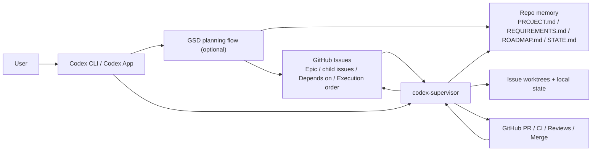
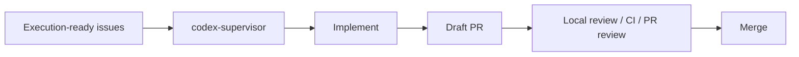
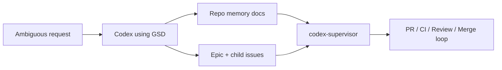
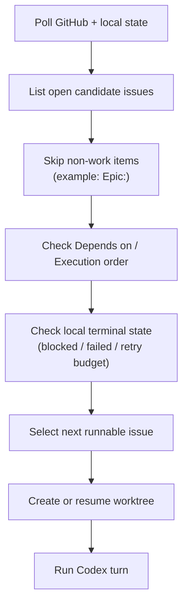
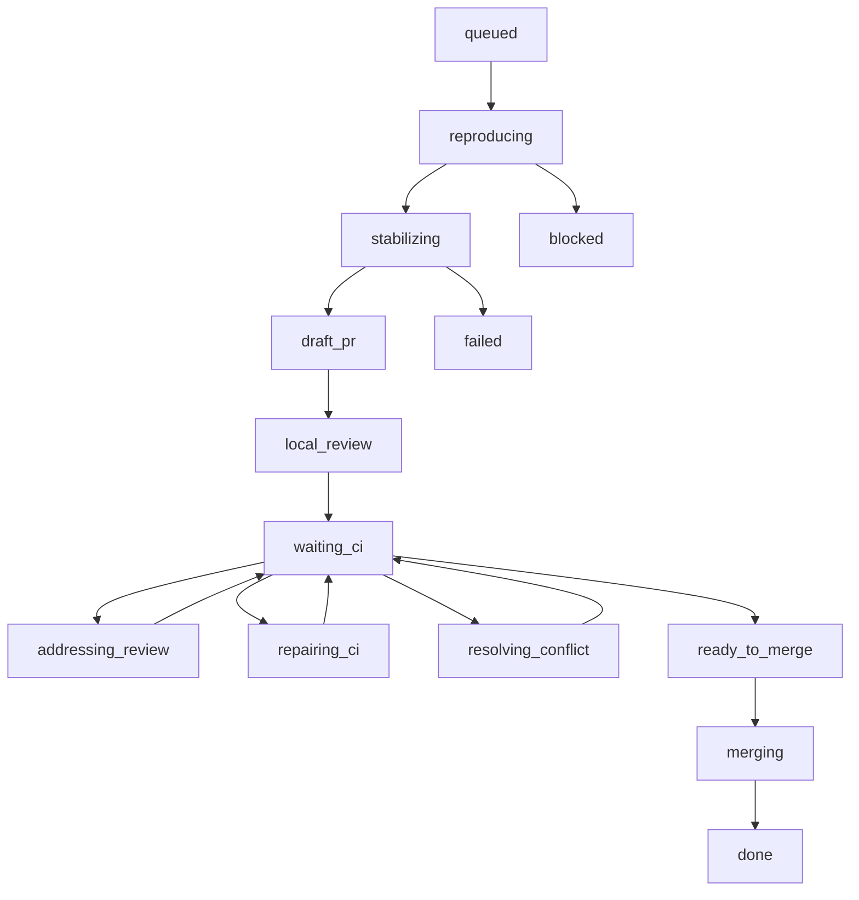

# codex-supervisor 入門

このガイドは、Codex CLI を入れたばかりの人、または Codex デスクトップアプリを使い始めた人向けです。

目的は次の 5 つです。

- `codex-supervisor` が何をするのか
- `codex-supervisor` 単独で使う場面
- `get-shit-done` (GSD) を先に使う場面
- 窓口として Codex にどう指示するか
- supervisor が次の issue をどう選ぶか

## 基本の考え方

Codex を operator console だと考えてください。

- あなたは Codex に話しかけます
- 要件が曖昧なら、Codex に GSD を使わせて整理します
- issue が実装可能な状態なら、Codex に `codex-supervisor` を使わせます

`codex-supervisor` は execution engine です。

- ローカル state を持つ
- issue ごとに worktree を作る
- `codex exec` を起動する
- PR、CI、review、mergeability を追跡する
- 本当に着手可能な issue だけを前に進める

GSD は optional な planning layer です。

- 実装前の整理に向いています
- issue が大きすぎる時の再分割に向いています
- blocked issue の再設計に向いています

## 全体像



この図で伝えたいことは 3 つです。

- 出発点は常に `User -> Codex`
- GSD は optional な planning tool
- `codex-supervisor` は downstream の execution tool

## codex-supervisor がやること

大まかなループは次の通りです。

1. GitHub と local state を再取得する
2. 次に runnable な issue を選ぶ
3. issue worktree を作成または再開する
4. Codex ターンを 1 回実行する
5. branch を push し、PR を作るか更新する
6. CI と review を待つ
7. failing check や妥当な review 指摘を修正する
8. merge 条件が揃ったら merge する
9. 次の runnable issue に進む

## 向いているケース

`codex-supervisor` は次のような repo に向いています。

- 1 人、または 1 execution lane で運用する
- issue が execution-ready である
- 依存関係が明示されている
- 実装順が明示されている
- CI と branch protection が整っている

典型例:

- 1 つの epic
- 複数の child issue
- `Depends on`
- `Part of`
- `Execution order`
- 明確な acceptance criteria

## 向いていないケース

次のような場合は弱いです。

- issue の優先順位が頻繁に変わる
- issue が相談単位で、実行単位ではない
- 複数人が同じ領域を同時に触る
- backlog に依存関係や順序の明示がない

その場合は、まず GSD を使って backlog を整えてから supervisor に渡してください。

## 2つの運用モード

### モード A: GSD を使わない

GitHub issue がすでに明確で、順序も依存関係も整っている場合です。

フロー:



Codex への指示例:

- 「Supervisor をビルドして、次の runnable issue を開始して」
- 「現在の supervisor の状態を見せて」
- 「PR の review コメントを確認して、妥当なら修正して」
- 「現在の PR の failing CI を調べて直して」

### モード B: GSD を使う

要件がまだ曖昧な場合です。

フロー:



Codex への指示例:

- 「GSD を使って、この機能を epic と child issue に分解して」
- 「この曖昧な要求を execution-ready issue 群にして」
- 「PROJECT.md、REQUIREMENTS.md、ROADMAP.md、STATE.md を更新して、issue 分解案を見せて」
- 「この issue は大きすぎるので、GSD で小さい依存付き issue に切り直して」

## GSD から supervisor への hand-off

GSD は supervisor の execution loop を置き換えるものではありません。

GSD に向いていること:

- feature framing
- phase planning
- dependency design
- acceptance criteria の整理
- repo memory の更新

GSD に向いていないこと:

- PR 監視
- CI 修復ループ
- merge 判定
- issue 単位の実装オーケストレーション

hand-off の境界はこうです。

1. GSD が planning docs を更新する
2. GSD の出力を GitHub の epic / child issue に落とす
3. その issue 群を supervisor が実行する

## GSD を使う時の repo memory

次のファイルを durable memory にするのが自然です。

- `PROJECT.md`
- `REQUIREMENTS.md`
- `ROADMAP.md`
- `STATE.md`
- `README.md`
- `docs/architecture.md`
- `docs/constitution.md`
- `docs/workflow.md`
- `docs/decisions.md`

supervisor は、まず compact context index を読み、その後必要な durable memory だけを on-demand で開きます。

## local review swarm

`codex-supervisor` は、local review swarm を pull request に対して実行できます。デフォルトの `localReviewPolicy` は `block_ready` なので、通常は draft PR を ready にする前に実行されます。`localReviewPolicy` を `block_merge` にすると、ready PR の head 更新時にも再実行できます。

重要な点は次の通りです。

- 各 role は別々の Codex turn で実行される
- 挙動は `localReviewPolicy` で決まる
- `advisory` は non-blocking、`block_ready` は draft から ready への進行を止め、`block_merge` は ready PR の merge を止める
- findings は Markdown と JSON artifact に保存される
- ここでも context 節約方針は同じで、まず compact context index と issue journal を読み、その後必要な durable memory だけを on-demand で開く

review role の選び方は 2 通りあります。

### 方法 1: role を自動検出する

最初はこれが推奨です。

`localReviewRoles` が空で、`localReviewAutoDetect` が `true` の場合、supervisor は managed repo の構成から role を推定します。

例:

```json
{
  "localReviewEnabled": true,
  "localReviewAutoDetect": true,
  "localReviewRoles": []
}
```

baseline は次です。

- `reviewer`
- `explorer`

そのうえで、repo の特徴に応じて specialist role を追加します。例えば:

- docs や durable memory がある -> `docs_researcher`
- Prisma schema と migrations がある -> `prisma_postgres_reviewer`, `migration_invariant_reviewer`, `contract_consistency_reviewer`
- Playwright を使う repo -> `ui_regression_reviewer`
- GitHub Actions workflow がある -> `github_actions_semantics_reviewer`
- workflow 向け test がある -> `workflow_test_reviewer`
- Node/script-heavy または workflow-heavy な repo -> `portability_reviewer`

初回セットアップでは、最初から role 設計を細かくしなくてよいので、この方法が扱いやすいです。

### 方法 2: role を明示指定する

完全に手動で制御したい場合は、role を明示指定します。

例:

```json
{
  "localReviewEnabled": true,
  "localReviewAutoDetect": false,
  "localReviewRoles": [
    "reviewer",
    "explorer",
    "docs_researcher",
    "prisma_postgres_reviewer",
    "migration_invariant_reviewer",
    "contract_consistency_reviewer"
  ]
}
```

この方法が向いているのは次のケースです。

- その repo に specialist reviewer が必要だと既に分かっている
- マシンごとの差を減らしたい
- swarm の比較検証を継続したい

### specialist role の役割

汎用 role は broad な bug hunt には役立ちますが、repo 固有の欠陥は取りこぼします。

例:

- `prisma_postgres_reviewer`
  - PostgreSQL の unique 制約 semantics、nullable unique の罠、partial index、Prisma/schema の不整合を見る
- `migration_invariant_reviewer`
  - app code では禁止しているのに DB では入ってしまう invalid state を見る
- `contract_consistency_reviewer`
  - contract、schema、docs、tests のズレを見る
- `ui_regression_reviewer`
  - browser flow や E2E regression の可能性を見る
- `github_actions_semantics_reviewer`
  - GitHub Actions の event/context ミス、concurrency の落とし穴、stale な cancelled check の扱いを見る
- `workflow_test_reviewer`
  - brittle な workflow test、regex 依存の assertion、path/cwd 前提の崩れやすさを見る
- `portability_reviewer`
  - shell glob、path、改行コード、OS 差異に起因する portability risk を見る

`atlaspm` のような repo では、generic role を増やすより、こうした specialist role を入れる方が効くことが多いです。

## issue 検知ではなく issue scheduling

ここが最重要です。

`codex-supervisor` は単純な `issue created` 監視ではありません。

本質は **readiness-driven** です。

つまり「新しく open された issue」を取るのではなく、**今着手可能な issue** を選びます。

## なぜ open 順ではいけないのか

例えば次の backlog を考えます。

```text
#101 Epic
#102 1 of 3
#103 2 of 3 Depends on: #102
#104 3 of 3 Depends on: #103
```

3 つの child issue はすべて open かもしれません。  
ですが runnable なのは `#102` だけです。

なので supervisor は、

- 最新 issue
- 最初に open された issue
- 作成順だけ

では選びません。

選ぶのは、

- **最初に runnable になっている issue**

です。

## readiness-driven scheduling の流れ



scheduler が見るもの:

- issue が open か
- label / search 条件に合うか
- skip 対象タイトルでないか
- dependency が解消されているか
- execution order が満たされているか
- local record が terminal state で止まっていないか
- stale な PR / failure state が reconciliation されているか

## issue 本文の書き方

よい issue には通常これが入ります。

- `Part of: #...`
- `Depends on: #...`
- `Parallelizable: Yes/No`
- `Execution order`
- `Acceptance criteria`

例:

```md
## Summary
Add a persisted recommendation severity model for wait stats findings.

Part of: #42
Depends on: #41
Parallelizable: No

## Execution order
2 of 4

## Acceptance criteria
- severity levels are defined in the domain model
- recommendation ranking uses the new severity model
- focused tests cover the ranking behavior
```

## 状態遷移

supervisor の中核は明示的な state machine です。



短い意味:

- `reproducing`: 問題を再現可能にする
- `stabilizing`: clean checkpoint に寄せる
- `draft_pr`: checkpoint を早めに公開する
- `local_review`: local advisory review swarm
- `waiting_ci`: checks または review grace 待ち
- `addressing_review`: bot review の妥当な指摘を直す
- `repairing_ci`: failing checks を直す
- `resolving_conflict`: dirty merge state を直す
- `ready_to_merge`: merge 条件が揃った
- `blocked`: 人手 clarification が必要
- `failed`: retry budget 枯渇か unrecoverable

## Local Review Swarm

local review swarm は、`gh pr ready` の前に走る optional review phase です。

典型的な role:

- `reviewer`
- `explorer`
- `docs_researcher`

やること:

- role ごとに独立した review turn を走らせる
- 実装ターンと同じ context budget policy を守る
- Markdown summary を書く
- structured JSON artifact を書く
- actionable な high severity findings については、より強い gate の前に verifier pass を走らせる
- findings を dedupe する
- confidence threshold 以上の findings だけ actionable として扱う

やらないこと:

- コード編集
- 単独で merge を止める
- GitHub branch protection の代替

artifact では、review role が出した raw actionable findings と verifier pass が確認した findings を分けて保存します。`block_ready` と `block_merge` は引き続き raw actionable findings に反応しますが、`localReviewHighSeverityAction` による強いエスカレーションは verifier が確認した high severity findings にだけ反応します。これにより、false positive の影響を減らせます。

## Codex への指示例

### supervisor を使う時

- 「Supervisor をビルドして、次の runnable issue を開始して」
- 「現在の supervisor status を報告して」
- 「現在の issue を再開して、PR、CI、review の状態を報告して」

### GSD を使う時

- 「GSD を使って、この feature を epic と child issue に分解して」
- 「GSD で planning docs を更新して、依存順を提案して」
- 「この blocked issue を、もっと小さい execution-ready issue に分けて」

### GSD から supervisor へ渡す時

- 「GSD で plan を整理し、repo memory と issue を更新したら、その後 supervisor に hand-off して」

## 最初の実行手順

1. Codex CLI を入れる
2. repo を clone する
3. `supervisor.config.json` を用意する
4. execution-ready issue を作る
5. 次を実行する

```bash
npm install
npm run build
node dist/index.js run-once --config /path/to/supervisor.config.json
node dist/index.js status --config /path/to/supervisor.config.json
```

6. 挙動が正しいことを確認したら次に進む

```bash
node dist/index.js loop --config /path/to/supervisor.config.json
```

## よくある失敗

- execution-ready でない backlog をそのまま supervisor に流す
- issue の作成順がそのまま実装順だと思い込む
- GSD の execution flow を supervisor loop に混ぜる
- chat memory に依存する
- `run-once` を見ずにいきなり `loop` を常駐させる

## 最後の指針

このルールだけ覚えておけば十分です。

- issue が明確なら `codex-supervisor`
- issue が曖昧なら先に GSD
- GSD の出力が explicit issue になったら supervisor に戻す

一言で言うと、

**GSD は backlog design、codex-supervisor は backlog execution です。**
