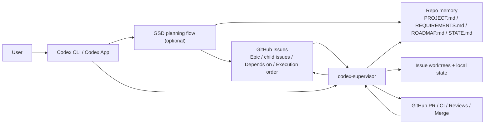
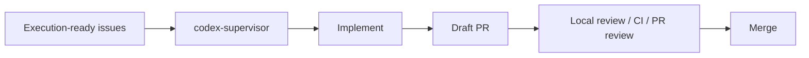
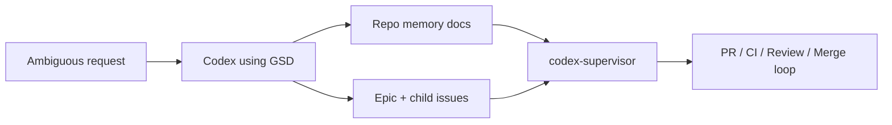
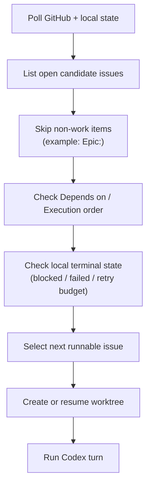
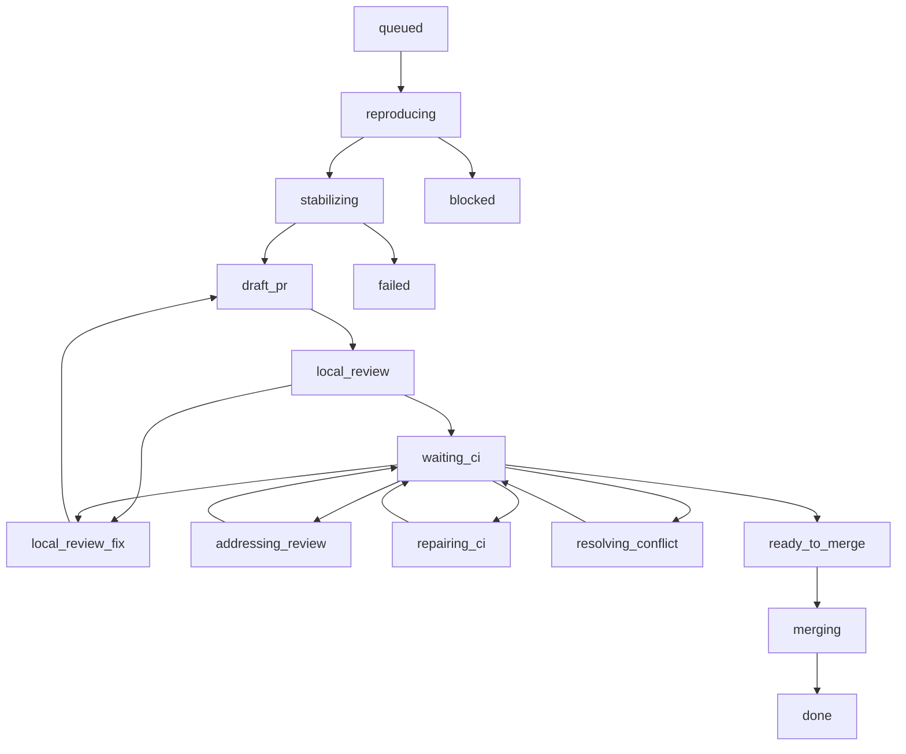

# Getting Started with codex-supervisor

This guide is for people who have just installed Codex CLI or started using the Codex desktop app.

The goal is to explain:

- what `codex-supervisor` is
- when to use `codex-supervisor` alone
- when to use `get-shit-done` (GSD) before the supervisor
- how to talk to Codex as your operator console
- how the supervisor actually chooses the next issue

## Mental model

Treat Codex as your operator console.

- You talk to Codex.
- Codex can help you use GSD when requirements are still ambiguous.
- Codex can help you run `codex-supervisor` when issues are already execution-ready.

`codex-supervisor` is the execution engine.

- It keeps local state.
- It creates issue worktrees.
- It runs `codex exec`.
- It tracks PRs, CI, reviews, and mergeability.
- It advances only when the current issue is actually runnable.

GSD is an optional planning layer.

- It is useful before execution starts.
- It is useful when a large issue needs to be split.
- It is useful when a blocked issue needs to be reframed.

## Full picture



## What codex-supervisor does

At a high level, the supervisor runs this loop:

1. Re-read GitHub and local state.
2. Select the first runnable issue.
3. Create or resume the issue worktree.
4. Run a Codex turn.
5. Push a branch and open or update a PR.
6. Wait for CI and reviews.
7. Repair CI or address valid review findings.
8. Merge when the gate conditions are satisfied.
9. Move to the next runnable issue.

## Best fit

`codex-supervisor` works best when:

- one person, or one execution lane, owns the repo automation
- issues are execution-ready
- dependencies are written down
- execution order is explicit
- CI and branch protection are already in place

Typical example:

- one epic
- several child issues
- `Depends on`
- `Part of`
- `Execution order`
- clear acceptance criteria

## Not a fit

It is a weak fit when:

- issue priority changes constantly
- issue descriptions are mostly discussion, not execution
- multiple people change the same code paths at once
- the backlog has no explicit dependencies or ordering

In those cases, use GSD first to improve the backlog before asking the supervisor to execute it.

## Two operating modes

### Mode A: Without GSD

Use this when your GitHub issues are already clear and sequenced.

Flow:



Typical prompts to Codex:

- "Build the supervisor and start working on the next runnable issue."
- "Show me the current supervisor status."
- "Check the PR review comments and fix valid ones."
- "Check the failing CI for the current PR and repair it."

### Mode B: With GSD

Use this when the work is still ambiguous.

Flow:



Typical prompts to Codex:

- "Use GSD to break this feature into an epic and child issues."
- "Use GSD to turn this vague request into execution-ready issues."
- "Update PROJECT.md, REQUIREMENTS.md, ROADMAP.md, and STATE.md, then show me the proposed issue breakdown."
- "This issue is too large. Use GSD to split it into smaller dependent issues."

## How GSD hands off to codex-supervisor

GSD should not replace the supervisor's execution loop.

Use GSD for:

- feature framing
- phase planning
- dependency design
- acceptance criteria
- repo memory updates

Do not use GSD for:

- PR monitoring
- CI repair loops
- merge gating
- issue-by-issue execution orchestration

The hand-off boundary is:

1. GSD updates planning docs.
2. GSD output becomes GitHub epic and child issues.
3. Those issues become the supervisor's queue.

## Recommended repo memory when using GSD

These files work well as durable shared memory:

- `PROJECT.md`
- `REQUIREMENTS.md`
- `ROADMAP.md`
- `STATE.md`
- `README.md`
- `docs/architecture.md`
- `docs/constitution.md`
- `docs/workflow.md`
- `docs/decisions.md`

The supervisor reads a compact context index first, then opens durable memory files only on demand.

## Local review swarm

`codex-supervisor` can run a local review swarm on pull requests. The recommended starting policy is `block_merge`, because it keeps the normal ready-for-review flow while still making the swarm a practical merge gate on the current PR head.

The important points are:

- each role runs in a separate Codex turn
- behavior is controlled by `localReviewPolicy`
- `block_merge` is the recommended default path: it gates merge on ready PRs and re-runs on ready PR head updates
- `block_ready` is stricter earlier in the flow: it gates draft-to-ready instead of merge
- `advisory` is non-blocking and best when you want saved findings without automation gates
- verifier-confirmed high-severity findings can trigger a dedicated `local_review_fix` turn that focuses on compressed root causes and the most relevant files
- findings are saved as Markdown and JSON artifacts
- the same context-budget policy still applies: read the compact context index and issue journal first, then open durable memory only on demand

There are two ways to choose reviewer roles.

### Option 1: Auto-detect roles

This is the recommended starting point.

If `localReviewRoles` is empty and `localReviewAutoDetect` is `true`, the supervisor detects a role set from the managed repo shape.

Example:

```json
{
  "localReviewEnabled": true,
  "localReviewAutoDetect": true,
  "localReviewRoles": []
}
```

The baseline is:

- `reviewer`
- `explorer`

Then the supervisor adds specialists when the repo suggests them. For example:

- docs or durable memory present -> `docs_researcher`
- Prisma schema + migrations present -> `prisma_postgres_reviewer`, `migration_invariant_reviewer`, `contract_consistency_reviewer`
- Playwright-heavy repo -> `ui_regression_reviewer`
- GitHub Actions workflows present -> `github_actions_semantics_reviewer`
- workflow-focused tests present -> `workflow_test_reviewer`
- Node/script-heavy or workflow-heavy repo -> `portability_reviewer`

The generated local review artifacts now show why each auto-detected role was selected:

- the Markdown summary includes an `Auto-detected roles` section with concise signal summaries
- the JSON artifact includes `autoDetectedRoles`, with machine-readable `kind`, `signal`, and `paths` fields for each selected role

When you want to override auto-detect manually, inspect those reasons first, then copy only the roles you want into `localReviewRoles` and set `localReviewAutoDetect` to `false`. That preserves the useful specialists while making the swarm deterministic.

This works well for first-time setup because you do not need to design the swarm up front.

### Option 2: Explicit roles

Use explicit roles when you want full manual control.

Example:

```json
{
  "localReviewEnabled": true,
  "localReviewAutoDetect": false,
  "localReviewRoles": [
    "reviewer",
    "explorer",
    "docs_researcher",
    "prisma_postgres_reviewer",
    "migration_invariant_reviewer",
    "contract_consistency_reviewer"
  ]
}
```

Use this when:

- you already know the repo needs specialist reviewers
- you want deterministic role selection across machines
- you want to compare swarm results over time

### What specialist roles are for

The generic roles are good at broad bug hunting, but they will miss some repo-specific defects.

Examples:

- `prisma_postgres_reviewer`
  - looks for PostgreSQL uniqueness semantics, nullable unique traps, partial indexes, and Prisma/schema drift
- `migration_invariant_reviewer`
  - looks for invalid persisted states that are blocked in app code but not enforced by the database
- `contract_consistency_reviewer`
  - compares contracts, schema, docs, and tests for drift
- `ui_regression_reviewer`
  - looks for likely browser-flow and end-to-end regressions
- `github_actions_semantics_reviewer`
  - looks for GitHub Actions event/context mistakes, concurrency pitfalls, and stale cancelled-check behavior
- `workflow_test_reviewer`
  - looks for brittle workflow tests, regex-heavy assertions, and path/cwd assumptions
- `portability_reviewer`
  - looks for shell glob, path, line-ending, and OS portability risks

In a repo like `atlaspm`, these specialist reviewers are often more useful than adding more generic reviewer turns.

## How issue scheduling actually works

This is the most important concept.

The supervisor is not primarily "issue-created driven".

It is "readiness-driven".

That means it does not simply pick the newest open issue. It looks for the next issue that is actually runnable.

## Why open issue order is not enough

Consider this backlog:

```text
#101 Epic
#102 1 of 3
#103 2 of 3 Depends on: #102
#104 3 of 3 Depends on: #103
```

All three child issues may already be open. But only `#102` is runnable.

So the supervisor should not use:

- "latest open issue"
- "first open issue"
- "issue creation time only"

It should use:

- "first runnable issue"

## How readiness-driven scheduling works



The scheduler considers:

- issue is open
- issue matches the configured label or search
- issue title is not skipped
- dependencies are satisfied
- execution order is satisfied
- local record is not terminal in a way that blocks retry
- stale PR or stale failure state has been reconciled

## Issue metadata format

A good issue body usually includes:

- `Part of: #...`
- `Depends on: #...`
- `Parallelizable: Yes/No`
- `Execution order`
- `Acceptance criteria`

Example:

```md
## Summary
Add a persisted recommendation severity model for wait stats findings.

Part of: #42
Depends on: #41
Parallelizable: No

## Execution order
2 of 4

## Acceptance criteria
- severity levels are defined in the domain model
- recommendation ranking uses the new severity model
- focused tests cover the ranking behavior
```

## State machine

The supervisor is built around explicit state transitions.



Short interpretation:

- `reproducing`: make the problem concrete
- `stabilizing`: move toward a clean checkpoint
- `draft_pr`: publish early when the checkpoint is coherent
- `local_review`: run a local advisory review swarm
- `local_review_fix`: apply the smallest repair that clears the active compressed local-review root causes
- `waiting_ci`: checks or review grace window
- `addressing_review`: fix valid bot review findings
- `repairing_ci`: fix failing checks
- `resolving_conflict`: fix a dirty merge state
- `ready_to_merge`: all gates are satisfied
- `blocked`: needs manual clarification
- `failed`: retry budget exhausted or unrecoverable condition

## Local review swarm

The local review swarm is an optional pre-ready review phase.

It is designed to catch defects before GitHub-hosted review becomes the only signal.

Typical roles:

- `reviewer`
- `explorer`
- `docs_researcher`

What it does:

- runs separate review turns per role
- keeps the same context-budget policy as implementation turns
- writes a Markdown summary
- writes a structured JSON artifact
- keeps older `head-<sha>` artifacts for history; `status` shows `head`, `reviewed_head_sha`, and `pr_head_sha` so you can see whether the latest actionable artifact still matches the PR
- runs a verifier pass for actionable high-severity findings before stronger high-severity gates react
- deduplicates findings
- keeps only findings that meet the configured reviewer-type confidence/severity thresholds as actionable

What it does not do by default:

- edit code
- block merge by itself
- replace GitHub branch protection

The artifacts keep raw actionable findings separate from verifier-confirmed findings. `block_ready` and `block_merge` still respond to raw actionable findings. `localReviewHighSeverityAction` only escalates on verifier-confirmed high-severity findings, which reduces false positives before the supervisor triggers a repair retry or manual block.

Baseline `reviewer` and `explorer` turns are treated as `generic` reviewers. Every other role is treated as a `specialist`. You can tune these two reviewer types independently with `localReviewReviewerThresholds`: each type has its own `confidenceThreshold` and `minimumSeverity`. Leaving that field unset preserves the old behavior by inheriting `localReviewConfidenceThreshold` and a `low` severity floor for both types.

For most solo-operator setups, prefer `localReviewHighSeverityAction: "blocked"` so verifier-confirmed high-severity findings stop the merge and force an explicit decision. Switch to `retry` only when you intentionally want the supervisor to launch another repair pass automatically.

Older local review artifacts remain on disk unless you clean them up explicitly. For live triage, trust the `status` output first: `head=current` means the artifact for `reviewed_head_sha` matches `pr_head_sha`, while `head=stale` means the artifact is historical and a newer PR head needs another review run.

If the supervisor sends the issue into `local_review_fix`, treat the active local-review blocker as the top priority. The repair prompt suppresses stale issue-journal `Next 1-3 actions` bullets so older checkpoint advice does not compete with the current blocker. If you need to force a temporary repair instruction anyway, write it explicitly in the journal as `- Operator override: ...`; that override remains visible in repair prompts.

Committed Local Review Swarm guardrails are maintained under `docs/shared-memory/`:

- `verifier-guardrails.json`
- `external-review-guardrails.json`

When you add or update an entry, follow the deterministic repo workflow:

1. Edit the committed JSON in `docs/shared-memory/`.
2. Run `npm run guardrails:fix` to normalize ordering and formatting.
3. Run `npm run guardrails:check` to catch malformed updates, duplicate verifier `id` values, duplicate external-review `fingerprint` values, or formatting drift before committing.

## What to ask Codex

### To use the supervisor

- "Build the supervisor and start the next runnable issue."
- "Show me the current supervisor status."
- "Resume the current issue and report the PR, CI, and review state."

### To use GSD before the supervisor

- "Use GSD to turn this feature into an epic and child issues."
- "Use GSD to update the planning docs and propose a dependency order."
- "Use GSD to split this blocked issue into smaller execution-ready issues."

### To bridge GSD into the supervisor

- "Use GSD to refine the plan, update repo memory, create the issues, then hand off to codex-supervisor."

## Suggested first-run workflow

1. Install Codex CLI.
2. Clone your repo.
3. Prepare `supervisor.config.json`.
4. Create execution-ready issues.
5. Run:

```bash
npm install
npm run build
node dist/index.js run-once --config /path/to/supervisor.config.json
node dist/index.js status --config /path/to/supervisor.config.json
```

6. When the behavior looks correct, switch to:

```bash
node dist/index.js loop --config /path/to/supervisor.config.json
```

## Common mistakes

- using the supervisor before the backlog is execution-ready
- expecting issue creation time to define execution order
- mixing GSD execution flows into the supervisor loop
- relying on chat memory instead of repo memory
- starting with `loop` before validating `run-once`

## Rule of thumb

Use this simple rule:

- if the issue is clear, use `codex-supervisor`
- if the issue is vague, use GSD first
- when GSD output becomes explicit issues, hand back to the supervisor

In one sentence:

**GSD designs the backlog. codex-supervisor executes the backlog.**
